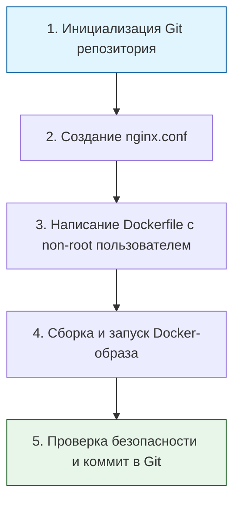

> [!abstract] Обзор главы
> В этой главе закладывается база для понимания работы инфраструктуры. Без глубокого знания операционных систем, сетей и принципов изоляции любые инструменты автоматизации и безопасности будут «черными ящиками».

| Подпункт | Фокус изучения | Ключевые технологии |
| :--- | :--- | :--- |
| **1.1. Операционные системы** | Управление памятью, файлами, правами и службами изнутри | Linux (RHEL, Ubuntu), Windows Server, systemd, ACL |
| **1.2. Сетевые технологии** | Полный путь данных, маршрутизация, фильтрация трафика | TCP/IP, OSI, DNS, DHCP, SSH, iptables |
| **1.3. Виртуализация и контейнеры** | Изоляция сред, экономия ресурсов, безопасность процессов | Docker, Kubernetes, VMware, Proxmox, cgroups, namespaces |
| **1.4. Системы управления версиями** | Отслеживание изменений, возможность мгновенного отката | Git, GitHub, GitLab, branching strategies |
| **1.5. Базы данных** | Хранение, индексация, резервирование и защита данных | PostgreSQL, Redis, ClickHouse, ElasticSearch |

---

## 1. 🎯 Суть и цель
Понимание работы ОС, сетей, виртуализации, систем контроля версий и баз данных изнутри. Это необходимо для поиска истинных причин сбоев, грамотной защиты серверов на глубоком уровне и построения предсказуемой, легко восстанавливаемой инфраструктуры. Нельзя защитить или автоматизировать то, принцип работы чего не до конца понятен.

---

## 2. 📚 Что изучить (Теория)

| Тема | Конкретные вопросы для изучения |
| :--- | :--- |
| **ОС Linux / Windows** | • Различие прав доступа: владелец, группа, остальные (chmod/chown) и списки контроля доступа (ACL). • Управление фоновыми службами: архитектура `systemd` (unit-файлы, target, зависимости). |
| **Сетевые технологии** | • Модель OSI: фокус на 3-м (сетевой, IP), 4-м (транспортный, TCP/UDP) и 7-м (прикладной, HTTP/DNS) уровнях. • Пошаговый процесс разрешения имен (DNS-запрос от клиента к рекурсивному и авторитативному серверу). |
| **Контейнеризация** | • Фундаментальное отличие контейнера от виртуальной машины: использование общих ядер ОС через механизмы `namespaces` (изоляция) и `cgroups` (ограничение ресурсов). |
| **Системы контроля версий** | • Базовый жизненный цикл Git: `init`, `add`, `commit`, `push`, создание и слияние веток (`branch`, `merge`). |
| **Базы данных** | • Архитектурное отличие реляционных СУБД (PostgreSQL, строгие таблицы, ACID) от key-value хранилищ в оперативной памяти (Redis, высокая скорость, кэширование). |

---

## 3. 💻 Практическая задача (Лабораторная работа)

**Название:** Развертывание безопасного и версионируемого веб-сервера в контейнере  
**Инструменты:** Локальный компьютер, Docker, текстовый редактор, Git.

**Пошаговое выполнение:**
1. **Версионирование:** Создайте новую папку, выполните `git init`.
2. **Конфигурация:** Создайте файл `nginx.conf`. Добавьте директиву `server_tokens off;` (скрытие версии сервера) и настройте `listen 8080;`.
3. **Контейнеризация (DevSecOps):** Напишите `Dockerfile`. Используйте базовый образ `nginx:alpine`. Добавьте инструкцию создания и переключения на непривилегированного пользователя (например, `USER nginx` или `USER 1000`), чтобы процесс не работал от имени `root`.
4. **Сборка и запуск:** Выполните `docker build -t secure-nginx .` и `docker run -d -p 8080:8080 --name my-nginx secure-nginx`.
5. **Фиксация:** Выполните `git add .` и `git commit -m "feat: add secure non-root nginx configuration"`.

---

## 4. ✅ Критерий успеха

| Проверка | Команда для терминала | Ожидаемый результат (Критерий успеха) |
| :--- | :--- | :--- |
| **История изменений** | `git log --oneline` | Вывод содержит коммит с понятным сообщением (например, `feat: add secure...`). |
| **Статус контейнера** | `docker ps` | Контейнер `my-nginx` находится в статусе `Up`. |
| **Скрытие версии** | `curl -I http://localhost:8080` | В заголовке ответа `Server:` указано просто `nginx`, **без** номера версии (например, не `nginx/1.21.0`). |
| **Безопасность процессов** | `docker exec -it my-nginx whoami` | Вывод команды: `nginx` (или `1000`), а **не** `root`. |

---

## 5. 🗣️ Фраза для собеседования

> «При настройке любого сервиса, будь то виртуальная машина или контейнер, я всегда исхожу из принципа минимальных привилегий. Например, я никогда не запускаю веб-серверы от имени суперпользователя root, принудительно скрываю технические детали в заголовках ответов и храню все конфигурационные файлы в системе контроля версий Git. Это делает среду предсказуемой, безопасной и легко восстанавливаемой в случае инцидента».