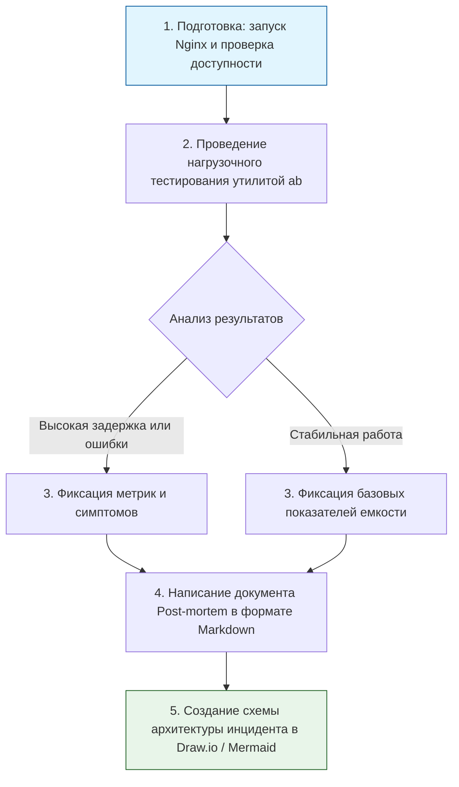

> [!abstract] Обзор главы
> В этой главе рассматриваются смежные дисциплины, которые отличают просто технического исполнителя от Senior-специалиста или архитектора. Сюда входят правовые аспекты, человеческий фактор, документация, методологии работы и принципы инженерии надежности (SRE).

| Подпункт | Фокус изучения | Ключевые технологии / Стандарты |
| :--- | :--- | :--- |
| **10.1. Правовые и нормативные основы** | Требования законов к обработке и защите данных, чтобы избежать штрафов и блокировок | 152-ФЗ, GDPR, PCI DSS, ISO 27001, NIST CSF |
| **10.2. Психология и социальная инженерия** | Понимание человеческого фактора как самого слабого звена и методы защиты от манипуляций | Фишинг, претекстинг, Security Awareness Training |
| **10.3. Аппаратное обеспечение и физическая защита** | Базовые принципы защиты физического доступа к серверам и аппаратного доверия | СКУД, видеонаблюдение, TPM-модули, изолированные сети (Air Gap) |
| **10.4. Технический английский и документация** | Чтение первоисточников, написание понятных инструкций и отчетов об инцидентах | RFC, Vendor Documentation, Markdown, Confluence, Draw.io |
| **10.5. Методологии и SRE** | Организация процессов разработки и эксплуатации, баланс между новыми фичами и стабильностью | Agile, Scrum, ITIL, SRE (SLI, SLO, Error Budgets) |
| **10.6. Нагрузочное тестирование** | Поиск узких мест в системе до того, как это сделают реальные пользователи при пиковом трафике | Apache Bench (ab), k6, JMeter, wrk |

---

## 1. 🎯 Суть и цель
Научиться мыслить категориями бизнеса и надежности, а не только командной строки. Цель — уметь обосновать необходимость затрат на безопасность перед руководством, грамотно оформить результаты расследования инцидента, спроектировать систему с учетом юридических требований и выстроить процессы так, чтобы человеческие ошибки минимизировались.

---

## 2. 📚 Что изучить (Теория)

| Тема | Конкретные вопросы для изучения |
| :--- | :--- |
| **Правовые основы и стандарты** | • Базовые требования 152-ФЗ: что считается персональными данными и как их нужно хранить (шифрование, обезличивание).<br>• Суть стандарта ISO 27001: система менеджмента информационной безопасности (СМИБ) как процесс, а не разовая настройка. |
| **Социальная инженерия** | • Механики фишинга и претекстинга (создание легенды для выманивания информации).<br>• Технические меры противодействия: DMARC/SPF/DKIM для почты, запрет макросов, изоляция рабочих станций. |
| **Документирование и Post-mortem** | • Принципы написания Blameless Post-mortem (отчет об инциденте без поиска виноватых, фокус на системных причинах).<br>• Структура хорошего отчета: Timeline (хронология), Root Cause (корневая причина), Impact (влияние), Action Items (план исправлений). |
| **SRE и нагрузочное тестирование** | • Разница между SLA (соглашение с клиентом), SLO (целевой показатель надежности) и SLI (фактический показатель, например, uptime 99.9%).<br>• Как правильно снимать метрики при нагрузочном тестировании: RPS (запросов в секунду), latency (задержка), error rate (процент ошибок). |

---

## 3. 💻 Практическая задача (Лабораторная работа)

**Название:** Проведение нагрузочного тестирования и написание отчета Post-mortem  
**Инструменты:** Локальный компьютер, Nginx (из предыдущих глав), утилита `ab` (Apache Bench, обычно есть в пакете `apache2-utils`) или `k6`, текстовый редактор.



**Пошаговое выполнение:**
1. **Подготовка:** Убедитесь, что ваш Nginx запущен и отдает страницу на `http://localhost:8080`.
2. **Нагрузочное тестирование:** Запустите тест, имитирующий резкий всплеск трафика. Например, 1000 запросов с 50 одновременными потоками:  
   `ab -n 1000 -c 50 http://localhost:8080/`
3. **Анализ вывода:** Найдите в выводе `ab` ключевые метрики:  
   * `Requests per second` (сколько запросов в секунду выдержал сервер).  
   * `Time per request (mean)` (среднее время ответа в мс).  
   * `Failed requests` (количество ошибок, должно быть 0).
4. **Написание Post-mortem:** Создайте файл `incident_report.md` и заполните его по шаблону:
   ```markdown
   # Post-mortem: Нагрузочное тестирование Nginx
   **Дата:** [Текущая дата]
   **Автор:** [Ваше имя]
   
   ## 1. Краткое описание
   Проведено стресс-тестирование веб-сервера для определения предельной емкости.
   
   ## 2. Метрики инцидента/теста
   - Целевая нагрузка: 1000 запросов, 50 параллельных соединений.
   - Фактическая пропускная способность: [вставить число] req/sec.
   - Среднее время отклика: [вставить число] ms.
   - Ошибки: [вставить число].
   
   ## 3. Корневая причина (Root Cause)
   [Например: Ограничение в конфигурации ОС на количество открытых файлов или нехватка воркеров Nginx].
   
   ## 4. План действий (Action Items)
   - [ ] Увеличить параметр `worker_connections` в nginx.conf.
   - [ ] Настроить мониторинг алертов по метрике `nginx_active_connections`.
   ```
5. **Визуализация:** Добавьте в конец файла простую схему (можно текстовую или Mermaid), показывающую поток трафика от тестировщика к серверу.

---

## 4. ✅ Критерий успеха

| Проверка | Действие | Ожидаемый результат (Критерий успеха) |
| :--- | :--- | :--- |
| **Успешный тест** | Запуск команды `ab` | Тест завершен, выведены сводные метрики (Time taken, Requests per second). |
| **Качество отчета** | Просмотр файла `incident_report.md` | Документ содержит все обязательные разделы, цифры взяты из реального вывода утилиты, план действий конкретный и измеримый. |
| **Понимание SRE** | Самостоятельная проверка | Вы можете объяснить разницу между `Failed requests` (ошибка приложения/сети) и высоким `Time per request` (деградация производительности). |

---

## 5. 🗣️ Фраза для собеседования

> «Я рассматриваю безопасность и надежность как часть бизнес-процессов, а не просто как набор технических настроек. При проектировании я всегда учитываю базовые требования регуляторов, такие как 152-ФЗ. А в случае сбоев я инициирую написание blameless post-mortem отчетов, чтобы находить и устранять системные причины проблем, а не искать виноватых, и использую принципы SRE для баланса между скоростью разработки и стабильностью системы».