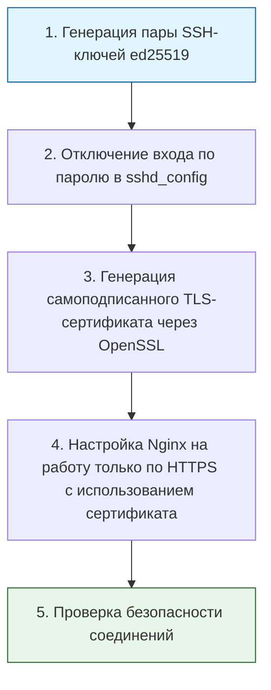

> [!abstract] Обзор главы
> В этой главе формируются базовые принципы защиты данных: строгий контроль того, кто имеет доступ к системе, шифрование передаваемой и хранимой информации, а также понимание типовых уязвимостей для их заблаговременного устранения.

| Подпункт | Фокус изучения | Ключевые технологии |
| :--- | :--- | :--- |
| **2.1. Управление доступом** | Принцип минимальных привилегий, строгая идентификация пользователей | SSH-ключи, MFA (многофакторная аутентификация), sudo, RBAC (ролевая модель доступа) |
| **2.2. Криптография** | Шифрование данных при передаче и хранении, управление секретами | OpenSSL, TLS/SSL-сертификаты, хеширование паролей, HashiCorp Vault |
| **2.3. Уязвимости и атаки** | Понимание векторов атак и методов их предотвращения на уровне конфигурации | OWASP Top 10 (десять самых критических рисков безопасности веб-приложений), CVE (база данных известных уязвимостей) |

---

## 1. 🎯 Суть и цель
Обеспечение конфиденциальности, целостности и доступности данных. Цель — выстроить эшелонированную защиту, при которой компрометация одного элемента (например, утечка пароля) не приводит к полному захвату системы, а передаваемые данные остаются нечитаемыми для посторонних.

---

## 2. 📚 Что изучить (Теория)

| Тема | Конкретные вопросы для изучения |
| :--- | :--- |
| **Управление доступом** | • Принцип минимальных привилегий (PoLP): выдача прав строго по необходимости. • Механизмы аутентификации: почему пароли устаревают и как работают SSH-ключи и TOTP (одноразовые пароли на время). • Управление привилегиями в Linux: настройка `/etc/sudoers` без предоставления полного root-доступа. |
| **Криптография** | • Разница между симметричным (один ключ) и асимметричным (пара открытый/закрытый ключ) шифрованием. • Основы протокола TLS: как происходит рукопожатие (handshake) и почему важны доверенные центры сертификации (CA). • Правила безопасного хранения секретов: запрет на хранение паролей и токенов в открытом виде в коде или конфигурационных файлах. |
| **Уязвимости и атаки** | • Базовый разбор OWASP Top 10: например, что такое SQL-инъекция (внедрение вредоносного кода в запрос к базе данных) и как от неё защищает параметризация запросов. • Понятие CVE (Common Vulnerabilities and Exposures) и процесс своевременного обновления ПО (patch management). |

---

## 3. 💻 Практическая задача (Лабораторная работа)

**Название:** Настройка беспарольного SSH-доступа и принудительного HTTPS для веб-сервера  
**Инструменты:** Локальный компьютер (Linux/macOS или WSL в Windows), OpenSSL, Nginx (из Главы 1).

**Пошаговое выполнение:**
1. **Аутентификация:** Сгенерируйте SSH-ключ командой `ssh-keygen -t ed25519 -C "admin@local"`. Скопируйте открытый ключ на целевой сервер (или локально в `~/.ssh/authorized_keys`).
2. **Управление доступом:** Откройте `/etc/ssh/sshd_config`, установите `PasswordAuthentication no` и `PermitRootLogin no`. Перезапустите службу SSH (`sudo systemctl restart sshd`).
3. **Криптография:** Сгенерируйте самоподписанный сертификат и закрытый ключ для локального домена:  
   `openssl req -x509 -nodes -days 365 -newkey rsa:2048 -keyout /etc/ssl/private/nginx-selfsigned.key -out /etc/ssl/certs/nginx-selfsigned.crt`
4. **Защита данных:** Измените конфигурацию Nginx из Главы 1. Добавьте блок `server`, слушающий порт 443 с директивами `ssl_certificate` и `ssl_certificate_key`, указывающими на созданные файлы. Добавьте редирект с 80-го порта на 443-й.
5. **Фиксация:** Закоммитьте изменения конфигурационных файлов (кроме закрытых ключей!) в Git.

---

## 4. ✅ Критерий успеха

| Проверка | Команда для терминала | Ожидаемый результат (Критерий успеха) |
| :--- | :--- | :--- |
| **Запрет парольного входа** | `ssh user@localhost` (без ключа) | Получен отказ в доступе: `Permission denied (publickey)`. |
| **Успешный вход по ключу** | `ssh user@localhost` (с ключом) | Успешное подключение к системе без запроса пароля. |
| **Работа HTTPS** | `curl -k https://localhost` | Возвращает `HTTP/2 200` или `HTTP/1.1 200 OK` и HTML-код страницы (флаг `-k` игнорирует предупреждение о самоподписанном сертификате). |
| **Проверка сертификата** | `openssl s_client -connect localhost:443 -servername localhost` | В выводе отображается блок `Certificate chain` с данными вашего самоподписанного сертификата. |

---

## 5. 🗣️ Фраза для собеседования

> «В своей работе я строго придерживаюсь принципа минимальных привилегий и защиты данных на всех этапах. Например, я полностью отключаю аутентификацию по паролям в пользу SSH-ключей, ограничиваю прямой вход под учетной записью root, а для всех веб-сервисов принудительно настраиваю шифрование трафика через TLS, чтобы исключить перехват данных в сети».