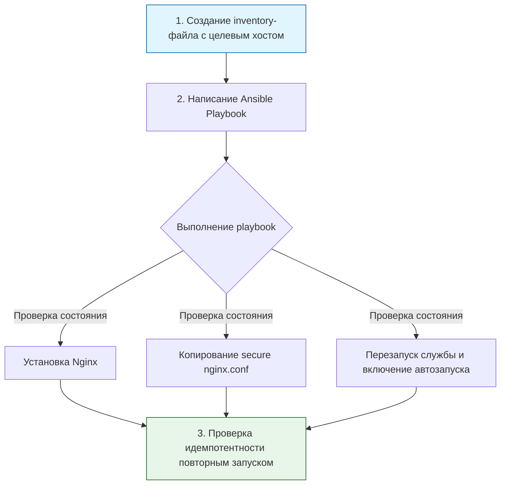

> [!abstract] Обзор главы
> В этой главе рассматриваются методы исключения человеческого фактора из процесса настройки и развертывания серверов. Инфраструктура описывается в виде кода, что гарантирует идентичность настроек, скорость развертывания и возможность мгновенного отката изменений.

| Подпункт | Фокус изучения | Ключевые технологии |
| :--- | :--- | :--- |
| **3.1. Управление конфигурациями** | Описание идеального состояния сервера в коде, идемпотентность (повторное применение не ломает систему) | Ansible, SaltStack, Chef |
| **3.2. Инфраструктура как код (IaC)** | Программное создание и уничтожение ресурсов (серверов, сетей, балансировщиков) | Terraform, Packer, Vagrant |
| **3.3. Скриптовые языки** | Автоматизация рутинных задач, парсинг логов, взаимодействие с API систем | Python, Bash, PowerShell |

---

## 1. 🎯 Суть и цель
Переход от ручной настройки серверов через SSH к декларативному описанию инфраструктуры. Это необходимо для того, чтобы развертывание нового сервера занимало минуты, а не часы, все настройки были задокументированы в коде, а любые отклонения от безопасного стандарта автоматически исправлялись при следующем запуске скрипта или плейбука.

---

## 2. 📚 Что изучить (Теория)

| Тема | Конкретные вопросы для изучения |
| :--- | :--- |
| **Скриптовые языки (Bash/Python)** | • Написание Bash-скриптов с обработкой ошибок (`set -e`, `set -u`).<br>• Основы Python: работа с модулями `os`, `sys`, `json`, отправка HTTP-запросов через библиотеку `requests` для взаимодействия с API. |
| **Управление конфигурациями (Ansible)** | • Архитектура Ansible: инвентарь (inventory), плейбуки (playbooks), роли (roles).<br>• Понятие идемпотентности: почему задача должна проверять текущее состояние перед внесением изменений.<br>• Использование модулей `apt`/`yum`, `copy`, `template`, `service`, `user`. |
| **Инфраструктура как код (Terraform/Packer)** | • Синтаксис HCL (HashiCorp Configuration Language).<br>• Жизненный цикл Terraform: `init`, `plan`, `apply`, `destroy`.<br>• Создание золотых образов (Golden Images) с помощью Packer для мгновенного развертывания уже настроенных виртуальных машин. |

---

## 3. 💻 Практическая задача (Лабораторная работа)

**Название:** Автоматизация безопасного развертывания веб-сервера с помощью Ansible  
**Инструменты:** Локальный компьютер (Linux/macOS/WSL), установленный Ansible, виртуальная машина или локальный хост для тестирования.



**Пошаговое выполнение:**
1. **Подготовка:** Установите Ansible (`sudo apt install ansible` или `pip install ansible`). Создайте файл `inventory.ini` с содержимым:
   ```ini
   [webservers]
   localhost ansible_connection=local
   ```
2. **Шаблон конфигурации:** Создайте файл `templates/nginx.conf.j2`. Вставьте туда конфигурацию из Главы 1 (с `server_tokens off;` и `listen 8080;`), но используйте переменную Ansible для порта: `listen {{ web_port }};`.
3. **Написание Playbook:** Создайте файл `site.yml`:
   ```yaml
   ---
   - name: Настройка безопасного веб-сервера
     hosts: webservers
     become: yes
     vars:
       web_port: 8080
     tasks:
       - name: Установка Nginx
         apt:
           name: nginx
           state: present
           update_cache: yes

       - name: Развертывание конфигурации из шаблона
         template:
           src: templates/nginx.conf.j2
           dest: /etc/nginx/nginx.conf
         notify: Restart Nginx

       - name: Запуск и включение автозапуска Nginx
         service:
           name: nginx
           state: started
           enabled: yes

     handlers:
       - name: Restart Nginx
         service:
           name: nginx
           state: restarted
   ```
4. **Запуск:** Выполните команду `ansible-playbook -i inventory.ini site.yml`.
5. **Проверка идемпотентности:** Запустите ту же команду второй раз.

---

## 4. ✅ Критерий успеха

| Проверка | Команда для терминала | Ожидаемый результат (Критерий успеха) |
| :--- | :--- | :--- |
| **Успешное выполнение** | `ansible-playbook -i inventory.ini site.yml` | Все задачи завершаются со статусом `ok` или `changed` (без ошибок `failed`). |
| **Идемпотентность** | Повторный запуск `ansible-playbook ...` | Все задачи завершаются со статусом `ok`, статус `changed` отсутствует (система не вносила лишних изменений). |
| **Применение конфигурации** | `curl -I http://localhost:8080` | Возвращает `200 OK`, версия Nginx скрыта (как в Главе 1). |
| **Статус службы** | `systemctl is-enabled nginx` | Вывод: `enabled` (служба добавлена в автозагрузку). |

---

## 5. 🗣️ Фраза для собеседования

> «Для исключения человеческих ошибок и дрейфа конфигураций я использую подход Infrastructure as Code. Например, вместо ручной настройки серверов я пишу идемпотентные плейбуки на Ansible, которые гарантируют, что целевая система всегда будет приведена к описанному в коде безопасному состоянию, а сам код хранится в Git с историей всех изменений».