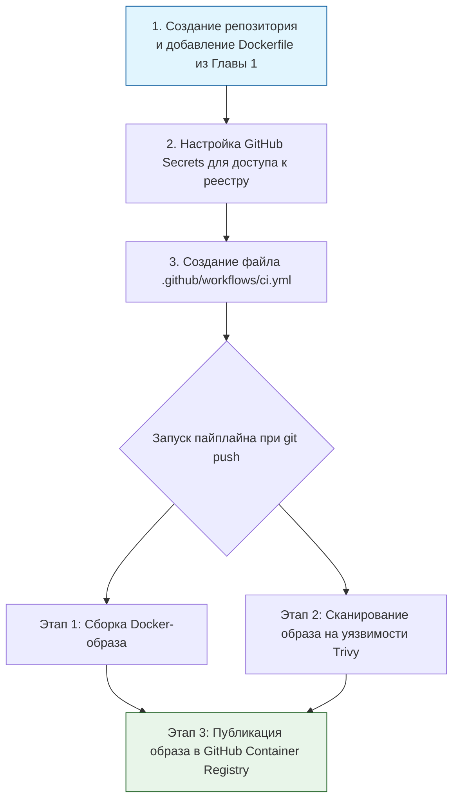

> [!abstract] Обзор главы
> В этой главе изучаются процессы автоматизации сборки, тестирования и развертывания программного обеспечения. Цель — исключить ручные операции при выпуске обновлений, находить ошибки на ранних этапах и гарантировать безопасную доставку кода до рабочих серверов.

| Подпункт | Фокус изучения | Ключевые технологии |
| :--- | :--- | :--- |
| **4.1. Системы непрерывной интеграции** | Автоматический запуск сборок и тестов при каждом изменении кода (push/merge request) | GitHub Actions, GitLab CI/CD, Jenkins |
| **4.2. Непрерывное развёртывание и GitOps** | Декларативное управление состоянием кластера, безопасные стратегии обновления без простоя | ArgoCD, Flux, Blue-Green, Canary (канареечные релизы) |
| **4.3. Артефакты и реестры образов** | Надежное и версионированное хранение сборок приложений и Docker-образов | Docker Registry, Harbor, GitHub Container Registry (GHCR) |

---

## 1. 🎯 Суть и цель
Создание автоматизированного конвейера (pipeline), который превращает исходный код в работающее приложение. Это необходимо для того, чтобы человеческий фактор был исключен из процесса релиза, любые ошибки сборки или уязвимости в зависимостях обнаруживались мгновенно, а откат к предыдущей стабильной версии занимал секунды.

---

## 2. 📚 Что изучить (Теория)

| Тема | Конкретные вопросы для изучения |
| :--- | :--- |
| **Основы CI/CD пайплайнов** | • Понятие этапов (stages/jobs): lint (проверка стиля кода), build (сборка), test (автотесты), deploy (развертывание).<br>• Триггеры запуска: по событию `push`, `pull request` или по расписанию (cron). |
| **Безопасность в CI/CD (DevSecOps)** | • Безопасное хранение секретов (токенов, паролей) в переменных окружения (Secrets), а не в коде.<br>• Интеграция статического анализа кода (SAST) и сканирования образов контейнеров на уязвимости (например, Trivy) прямо в пайплайн. |
| **Принципы GitOps** | • Концепция «Git как единственный источник истины»: состояние инфраструктуры в кластере должно всегда стремиться к тому, что описано в Git-репозитории.<br>• Различие между push-моделью (CI-система сама пушит код на сервер) и pull-моделью (агент в кластере, например ArgoCD, сам забирает изменения из Git). |

---

## 3. 💻 Практическая задача (Лабораторная работа)

**Название:** Создание безопасного CI/CD пайплайна для сборки и проверки Docker-образа  
**Инструменты:** Аккаунт на GitHub, локальный компьютер с Git, текстовый редактор.



**Пошаговое выполнение:**
1. **Подготовка:** Создайте новый публичный репозиторий на GitHub. Добавьте туда `Dockerfile` и `nginx.conf` из Главы 1.
2. **Настройка пайплайна:** Создайте в репозитории директорию `.github/workflows` и в ней файл `ci.yml`.
3. **Написание YAML-конфигурации:** Вставьте в `ci.yml` следующий код (он автоматически собирает образ и проверяет его на уязвимости):
   ```yaml
   name: Secure Docker Build and Scan

   on:
     push:
       branches: [ "main" ]

   jobs:
     build-and-scan:
       runs-on: ubuntu-latest
       steps:
         - name: Checkout кода
           uses: actions/checkout@v3

         - name: Сборка Docker-образа
           run: docker build -t my-secure-nginx:${{ github.sha }} .

         - name: Сканирование образа на уязвимости (Trivy)
           uses: aquasecurity/trivy-action@master
           with:
             image-ref: 'my-secure-nginx:${{ github.sha }}'
             format: 'table'
             exit-code: '1' # Пайплайн упадет с ошибкой, если найдутся критические уязвимости
             ignore-unfixed: true
             severity: 'CRITICAL,HIGH'
   ```
4. **Запуск:** Сделайте коммит и push (`git push origin main`). Перейдите во вкладку "Actions" на GitHub.

---

## 4. ✅ Критерий успеха

| Проверка | Действие | Ожидаемый результат (Критерий успеха) |
| :--- | :--- | :--- |
| **Запуск пайплайна** | Вкладка "Actions" в репозитории GitHub | Видна успешная сборка (зеленая галочка) с именем "Secure Docker Build and Scan". |
| **Проверка безопасности** | Просмотр логов шага "Сканирование образа на уязвимости" | В логах виден вывод таблицы Trivy. Если критических уязвимостей нет, шаг завершается успешно (зеленый). Если есть — пайплайн падает (красный), что доказывает работу защиты. |
| **Существование образа** | Команда локально (если настроен push) или визуальная проверка в Actions | Образ успешно собран с тегом, соответствующим хешу коммита (`${{ github.sha }}`). |

---

## 5. 🗣️ Фраза для собеседования

> «Я выстраиваю процесс доставки кода по принципам CI/CD и DevSecOps. Например, в моих пайплайнах сборка образа неразрывно связана с этапом автоматического сканирования на уязвимости. Если инструмент анализа находит критические проблемы в зависимостях, сборка прерывается, и небезопасный код физически не может попасть в продакшн-окружение».