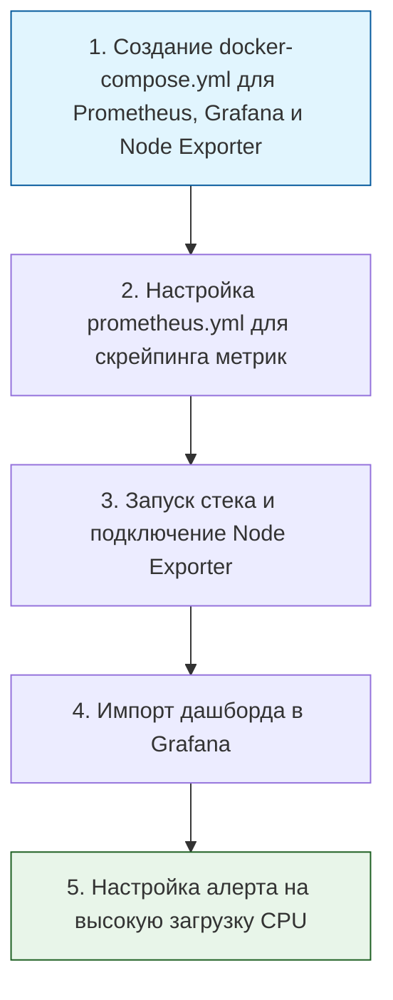

> [!abstract] Обзор главы
> В этой главе изучаются принципы наблюдаемости (Observability) инфраструктуры. Переход от реактивного тушения пожаров к проактивному обнаружению сбоев и аномалий безопасности с помощью метрик, централизованных логов и систем корреляции событий (SIEM).

| Подпункт | Фокус изучения | Ключевые технологии |
| :--- | :--- | :--- |
| **5.1. Мониторинг инфраструктуры** | Сбор и визуализация метрик производительности, настройка алертинга | Prometheus, Grafana, Node Exporter, Alertmanager, Zabbix |
| **5.2. Сбор и анализ логов** | Централизованный сбор, парсинг и полнотекстовый поиск по журналам событий | ELK Stack (Elasticsearch, Logstash, Kibana), Loki, Promtail, Fluentd |
| **5.3. Системы SIEM** | Корреляция событий безопасности, создание правил детектирования атак | Wazuh, Splunk, Elastic Security, Microsoft Sentinel |
| **5.4. Трейсинг** | Отслеживание пути запроса через распределенные микросервисы | OpenTelemetry, Jaeger, Zipkin |

---

## 1. 🎯 Суть и цель
Обеспечение полной наблюдаемости (Observability) системы. Цель — знать о проблемах (аппаратных сбоях, нехватке ресурсов, сетевых атаках) раньше, чем их заметят пользователи, и иметь достаточно данных (логов и метрик) для мгновенного расследования причин инцидента.

---

## 2. 📚 Что изучить (Теория)

| Тема | Конкретные вопросы для изучения |
| :--- | :--- |
| **Метрики и алертинг** | • Различие между метриками (числовые данные во времени, например, CPU load) и логами (текстовые записи событий). • Архитектура Prometheus: pull-модель (система сама опрашивает цели через HTTP), экспортеры (Node Exporter), язык запросов PromQL. • Настройка правил алертинга в Alertmanager и маршрутизация уведомлений (в Telegram, Slack, почту). |
| **Централизованное логирование** | • Структура лога: timestamp, level (INFO, ERROR), message, metadata. • Архитектура стека ELK (Elasticsearch для хранения и поиска, Logstash/Fluentd для парсинга и маршрутизации, Kibana для визуализации) или более легкого стека Loki + Promtail. • Парсинг неструктурированных логов в структурированный формат (JSON). |
| **SIEM и безопасность** | • Принципы работы SIEM: нормализация событий из разных источников (ОС, сеть, приложения) к единому формату. • Написание правил корреляции (например, «5 неудачных входов по SSH за 1 минуту + успешный вход = Brute Force»). |

---

## 3. 💻 Практическая задача (Лабораторная работа)

**Название:** Развертывание стека мониторинга Prometheus + Grafana с настройкой алерта  
**Инструменты:** Локальный компьютер, Docker, Docker Compose.

**Пошаговое выполнение:**
1. **Подготовка:** Создайте папку `monitoring` и в ней файл `docker-compose.yml`. Добавьте сервисы `prom/prometheus`, `grafana/grafana` и `prom/node-exporter`.
2. **Конфигурация Prometheus:** Создайте файл `prometheus.yml`. Настройте `scrape_configs` для сбора метрик с `node-exporter` (порт 9100) каждые 15 секунд.
3. **Запуск:** Выполните `docker-compose up -d`.
4. **Визуализация:** Откройте Grafana (порт 3000). Добавьте Prometheus как источник данных (Data Source). Создайте новый Dashboard и добавьте панель с запросом PromQL: `100 - (avg by(instance) (rate(node_cpu_seconds_total{mode="idle"}[1m])) * 100)` (показывает загрузку CPU в процентах).
5. **Алертинг:** В настройках панели Grafana добавьте Alert Rule: если значение > 80% в течение 1 минуты, отправлять уведомление (можно настроить тестовый webhook или просто проверить срабатывание статуса в UI). Для теста можно искусственно нагрузить контейнер.

---

## 4. ✅ Критерий успеха

| Проверка | Действие | Ожидаемый результат (Критерий успеха) |
| :--- | :--- | :--- |
| **Сбор метрик** | Переход в статус Prometheus (порт 9090) -> Targets | Статус `node-exporter` — `UP`, время последнего скрейпинга обновляется. |
| **Визуализация** | Открытие дашборда в Grafana (порт 3000) | График загрузки CPU и памяти отображается в реальном времени, линии не прерываются. |
| **Срабатывание алерта** | Искусственная нагрузка (например, запуск стресс-теста внутри контейнера) или изменение порога | Статус алерта в Grafana меняется с `Normal` на `Pending`, а затем на `Firing`. |

---

## 5. 🗣️ Фраза для собеседования

> «Я выстраиваю мониторинг по принципу полной наблюдаемости, разделяя метрики, логи и трейсы. Например, для инфраструктуры я использую связку Prometheus и Grafana с настроенным алертингом на аномальные показатели, а для безопасности внедряю правила корреляции в SIEM, чтобы автоматически детектировать брутфорс-атаки или подозрительную активность еще до того, как они приведут к инциденту».