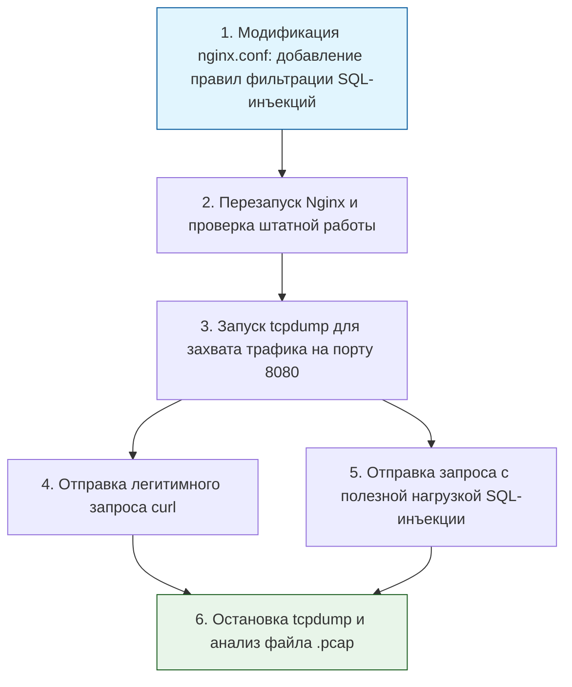

> [!abstract] Обзор главы
> В этой главе изучаются методы фильтрации сетевого трафика, обнаружения вторжений и защиты приложений на сетевом и прикладном уровнях. Цель — создать эшелонированную оборону, которая отсекает злонамеренные подключения до того, как они достигнут внутренних сервисов.

| Подпункт | Фокус изучения | Ключевые технологии |
| :--- | :--- | :--- |
| **6.1. Межсетевые экраны и прокси** | Stateful-фильтрация пакетов, политика «запрещено по умолчанию», обратное проксирование | iptables, nftables, Nginx (reverse proxy), HAProxy |
| **6.2. Системы обнаружения и предотвращения вторжений (IDS/IPS)** | Сигнатурный и аномальный анализ трафика, выявление сканирования портов и эксплойтов | Snort, Suricata, Falco (для контейнеров) |
| **6.3. Анализ сетевого трафика** | Глубокий разбор пакетов (DPI), чтение дампов трафика, выявление утечек данных | Wireshark, tcpdump, tshark |
| **6.4. Защита веб-приложений (WAF)** | Инспекция HTTP/HTTPS-запросов, блокировка инъекций и межсайтового скриптинга (XSS) | ModSecurity, OWASP Core Rule Set, Cloudflare WAF |

---

## 1. 🎯 Суть и цель
Минимизация поверхности атаки (Attack Surface) на сетевом уровне. Правильная настройка периметра гарантирует, что внутренние сервисы не будут напрямую доступны из интернета, а любой подозрительный трафик (например, попытки подбора паролей или SQL-инъекции) будет заблокирован и залогирован для последующего анализа.

---

## 2. 📚 Что изучить (Теория)

| Тема | Конкретные вопросы для изучения |
| :--- | :--- |
| **Межсетевые экраны (Firewall)** | • Разница между stateless (простая фильтрация по IP/порту) и stateful (отслеживание состояния соединения) фильтрацией.<br>• Принцип «Default Deny» (запрещать всё, что явно не разрешено).<br>• Архитектура DMZ (демилитаризованной зоны) для изоляции публичных сервисов. |
| **IDS/IPS (Обнаружение и предотвращение)** | • Различия между NIDS (сетевая система, анализирует копии трафика) и HIDS (хостовая система, анализирует логи и системные вызовы, например, Falco).<br>• Принцип работы сигнатурных правил (например, в Suricata) и проблемы ложных срабатываний (False Positives). |
| **Анализ трафика (PCAP)** | • Структура сетевого пакета: заголовки Ethernet, IP, TCP и полезная нагрузка (payload).<br>• Умение читать дампы в Wireshark: фильтрация по IP, портам, флагам TCP (SYN, ACK, FIN) и содержимому HTTP-запросов. |
| **Web Application Firewall (WAF)** | • Как WAF анализирует тело HTTP-запроса (POST/GET) на наличие паттернов атак (например, ключевые слова SQL или теги `<script>`).<br>• Режимы работы WAF: Detection (только логирование) и Prevention (блокировка запроса). |

---

## 3. 💻 Практическая задача (Лабораторная работа)

**Название:** Настройка базового WAF на Nginx и анализ заблокированного трафика через tcpdump  
**Инструменты:** Локальный компьютер (Linux/macOS/WSL), Nginx, tcpdump, curl.



**Пошаговое выполнение:**
1. **Настройка WAF-правил:** Откройте ваш `nginx.conf` (из Главы 1). Внутри блока `server` добавьте директиву для блокировки типичных SQL-ключевых слов в строке запроса:
   ```nginx
   server {
       listen 8080;
       server_tokens off;
       
       # Базовое правило WAF: блокировка SQL-инъекций в query string
       if ($query_string ~* "(union|select|insert|drop|delete|update)") {
           return 403 "Forbidden: Potential SQL Injection detected\n";
       }

       location / {
           root /usr/share/nginx/html;
           index index.html;
       }
   }
   ```
2. **Применение:** Проверьте конфигурацию (`nginx -t`) и перезапустите Nginx (`sudo systemctl restart nginx` или `docker restart <container>`).
3. **Захват трафика:** Запустите прослушивание локального интерфейса в фоне:  
   `sudo tcpdump -i lo -w network_traffic.pcap port 8080`
4. **Тестирование:**  
   * Отправьте нормальный запрос: `curl http://localhost:8080` (должен вернуть `200 OK`).  
   * Отправьте запрос с атакой: `curl "http://localhost:8080/?id=1 UNION SELECT password FROM users"` (должен вернуть `403 Forbidden`).
5. **Остановка анализа:** Остановите tcpdump нажатием `Ctrl+C`.

---

## 4. ✅ Критерий успеха

| Проверка | Команда для терминала | Ожидаемый результат (Критерий успеха) |
| :--- | :--- | :--- |
| **Блокировка атаки** | `curl "http://localhost:8080/?id=1 UNION SELECT"` | Возвращает код `403` и текст "Forbidden: Potential SQL Injection detected". |
| **Штатная работа** | `curl -I http://localhost:8080` | Возвращает код `200 OK`. |
| **Наличие дампа** | `ls -l network_traffic.pcap` | Файл существует и имеет размер больше 0 байт. |
| **Анализ дампа** | `tcpdump -r network_traffic.pcap -A | grep "UNION"` | В выводе виден перехваченный HTTP-запрос с текстом атаки, подтверждая, что трафик дошел до сервера, но был обработан (и заблокирован) правилами Nginx. |

---

## 5. 🗣️ Фраза для собеседования

> «При защите периметра я всегда применяю стратегию эшелонированной обороны. На сетевом уровне я настраиваю межсетевые экраны по принципу "запрещено по умолчанию", оставляя открытыми только необходимые порты. На прикладном уровне я обязательно ставлю обратный прокси с правилами WAF (например, ModSecurity или кастомные правила Nginx), чтобы отсекать попытки SQL-инъекций и XSS еще до того, как запрос достигнет бизнес-логики приложения, параллельно логируя эти события для SIEM».