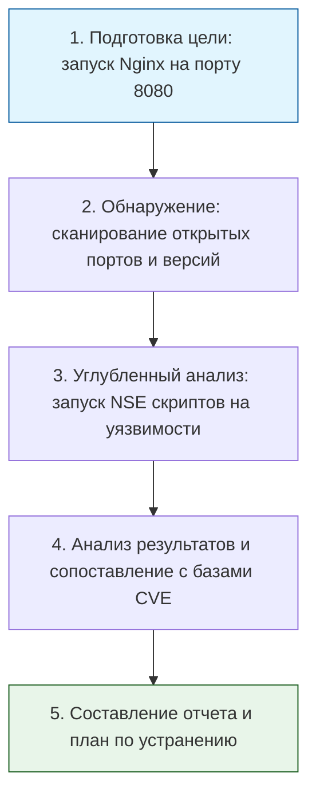

> [!abstract] Обзор главы
> В этой главе рассматриваются методы проактивного поиска уязвимостей в собственных системах. Изучается мышление злоумышленника, инструменты для разведки, сканирования и эксплуатации слабых мест, чтобы устранить их до того, как ими воспользуются настоящие хакеры.

| Подпункт | Фокус изучения | Ключевые технологии |
| :--- | :--- | :--- |
| **7.1. Сканирование и разведка** | Сбор информации о цели, поиск открытых портов, сервисов и скрытых директорий | Nmap, Masscan, Nikto, Gobuster |
| **7.2. Эксплуатация уязвимостей** | Безопасное использование найденных слабостей для доказательства рисков (Proof of Concept) | Metasploit Framework, Burp Suite, SQLmap |
| **7.3. Реверс-инжиниринг и анализ ПО** | Статический и динамический анализ скомпилированного кода, поиск сигнатур вредоносного ПО | Ghidra, Radare2, YARA, Wireshark |

---

## 1. 🎯 Суть и цель
Переход от пассивной защиты к активной. Цель — регулярно проверять инфраструктуру на прочность в контролируемых и легальных условиях. Это позволяет находить «слепые зоны» в настройках безопасности, оценивать реальный бизнес-риск от уязвимостей и проверять эффективность настроенных ранее систем мониторинга и защиты (Главы 5 и 6).

---

## 2.  Что изучить (Теория)

| Тема | Конкретные вопросы для изучения |
| :--- | :--- |
| **Разведка и сканирование (Reconnaissance)** | • Пассивная разведка (OSINT) против активной разведки (сканирование портов). • Методы сканирования TCP (SYN scan, Connect scan) и UDP. • Определение версий сервисов и операционной системы по косвенным признакам (fingerprinting). |
| **Эксплуатация и Post-Exploitation** | • Понятие Reverse Shell (обратная оболочка) и Bind Shell, разница в их работе через межсетевые экраны. • Жизненный цикл атаки (Cyber Kill Chain и MITRE ATT&CK). • Принципы безопасного тестирования: как не положить продакшн-сервер во время проверки. |
| **Реверс-инжиниринг и малварь** | • Различие между статическим анализом (чтение кода без запуска) и динамическим анализом (запуск в изолированной песочнице/sandbox). • Написание правил YARA для поиска специфичных паттернов в файлах или сетевом трафике. |

---

## 3. 💻 Практическая задача (Лабораторная работа)

**Название:** Аудит безопасности локального веб-сервера с помощью Nmap и NSE-скриптов  
**Инструменты:** Локальный компьютер (Linux/macOS/WSL), установленный Nmap, запущенный Nginx (из предыдущих глав).

**Пошаговое выполнение:**
1. **Подготовка:** Убедитесь, что ваш контейнер или локальный Nginx из Главы 1 запущен и слушает порт 8080.
2. **Базовое сканирование:** Выполните команду для определения открытых портов и версий сервисов:  
   `nmap -sV -p 8080 localhost`  
   *(Флаг `-sV` определяет версию сервиса, `-p` указывает конкретный порт).*
3. **Сканирование на уязвимости (NSE):** Nmap имеет встроенный скриптовый движок (Nmap Scripting Engine). Запустите сканирование с набором скриптов для поиска известных уязвимостей:  
   `nmap --script vuln -p 8080 localhost`
4. **Анализ HTTP-заголовков:** Запустите специализированный скрипт для проверки безопасности HTTP-заголовков:  
   `nmap --script http-headers -p 8080 localhost`
5. **Документирование:** Сохраните вывод в файл в формате XML или текстовом виде для последующего анализа:  
   `nmap -sV --script vuln -p 8080 localhost -oN scan_report.txt`

---

## 4. ✅ Критерий успеха

| Проверка | Команда для терминала | Ожидаемый результат (Критерий успеха) |
| :--- | :--- | :--- |
| **Обнаружение сервиса** | `nmap -sV -p 8080 localhost` | В выводе видно: `PORT 8080/tcp open http nginx`. |
| **Скрытие версии (Проверка Главы 1)** | Тот же вывод Nmap | Nmap показывает `nginx`, но **не может** определить точную версию (пишет `product: nginx` без поля `version`), что подтверждает эффективность `server_tokens off;`. |
| **Результат NSE-скриптов** | Просмотр файла `scan_report.txt` | Скрипты отработали без ошибок. В разделе `http-headers` видно отсутствие опасных заголовков, а скрипты `vuln` не нашли критических CVE (так как мы обновили образ и скрыли версию). |

---

## 5. ️ Фраза для собеседования

> «Я подхожу к безопасности проактивно, регулярно проводя аудит инфраструктуры методами, близкими к пентесту. Например, я использую Nmap с NSE-скриптами для автоматического поиска известных уязвимостей и анализа конфигураций, а результаты сканирования сопоставляю с базой CVE. Это позволяет мне находить и закрывать дыры в настройках еще до того, как их смогут эксплуатировать злоумышленники, и проверять, действительно ли настроенные WAF и SIEM видят подобные активности».