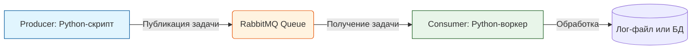

> [!abstract] Обзор главы
> В этой главе изучаются принципы построения распределенных, масштабируемых и отказоустойчивых систем. Рассматривается переход от монолитной архитектуры к микросервисной, использование облачных ресурсов и асинхронного взаимодействия между компонентами для выдерживания высоких нагрузок.

| Подпункт | Фокус изучения | Ключевые технологии |
| :--- | :--- | :--- |
| **8.1. Публичные облака** | Модель разделения ответственности (Shared Responsibility), управление облачными ресурсами через API | AWS, Yandex Cloud, Selectel, Terraform (для облаков) |
| **8.2. Микросервисная архитектура** | Декомпозиция монолита, независимое развертывание сервисов, сервис-меши и API-шлюзы | Kubernetes, Docker, Istio, REST API, gRPC |
| **8.3. Очереди сообщений** | Асинхронная коммуникация, буферизация нагрузки, гарантия доставки сообщений | RabbitMQ, Apache Kafka, Redis Streams |

---

## 1. 🎯 Суть и цель
Обеспечение горизонтального масштабирования и высокой доступности (High Availability) приложений. Цель — научиться проектировать системы, где отказ одного компонента не приводит к падению всего приложения, а пиковые нагрузки сглаживаются за счет асинхронной обработки задач через очереди сообщений.

---

## 2. 📚 Что изучить (Теория)

| Тема | Конкретные вопросы для изучения |
| :--- | :--- |
| **Облачные вычисления** | • Модель IaaS, PaaS, SaaS и разделение ответственности за безопасность между провайдером и клиентом.<br>• Понятия регионов, зон доступности (Availability Zones) и групп безопасности (Security Groups). |
| **Микросервисная архитектура** | • Принципы микросервисов: слабая связность (loose coupling), высокая зацепленность внутри сервиса (high cohesion).<br>• Паттерны коммуникации: синхронная (REST/gRPC) vs асинхронная (очереди).<br>• Роль оркестратора (Kubernetes) в управлении жизненным циклом, масштабированием и самовосстановлением контейнеров. |
| **Очереди сообщений (Message Brokers)** | • Различия между очередями задач (RabbitMQ) и потоковой передачей событий (Kafka).<br>• Паттерны: Publish/Subscribe (Издатель/Подписчик) и Point-to-Point.<br>• Понятия идемпотентности обработки сообщений и механизма Dead Letter Queue (очередь недоставленных сообщений). |

---

## 3. 💻 Практическая задача (Лабораторная работа)

**Название:** Развертывание асинхронной микросервисной архитектуры с очередью сообщений  
**Инструменты:** Локальный компьютер, Docker, Docker Compose, Python (базовый уровень).



**Пошаговое выполнение:**
1. **Подготовка окружения:** Создайте папку `microservices-lab` и внутри нее файл `docker-compose.yml`.
2. **Настройка брокера:** Добавьте сервис RabbitMQ в `docker-compose.yml`:
   ```yaml
   services:
     rabbitmq:
       image: rabbitmq:3-management
       ports:
         - "5672:5672"
         - "15672:15672" # Веб-интерфейс управления
   ```
3. **Создание Producer (Отправитель):** Создайте файл `producer.py`:
   ```python
   import pika
   connection = pika.BlockingConnection(pika.ConnectionParameters('rabbitmq'))
   channel = connection.channel()
   channel.queue_declare(queue='task_queue', durable=True)
   channel.basic_publish(exchange='', routing_key='task_queue', body='Hello from Producer!', properties=pika.BasicProperties(delivery_mode=2))
   print(" [x] Sent 'Hello from Producer!'")
   connection.close()
   ```
4. **Создание Consumer (Получатель):** Создайте файл `consumer.py`:
   ```python
   import pika, time
   def callback(ch, method, properties, body):
       print(f" [x] Received {body.decode()}")
       time.sleep(2) # Имитация тяжелой работы
       print(" [x] Done")
       ch.basic_ack(delivery_tag=method.delivery_tag)

   connection = pika.BlockingConnection(pika.ConnectionParameters('rabbitmq'))
   channel = connection.channel()
   channel.queue_declare(queue='task_queue', durable=True)
   channel.basic_qos(prefetch_count=1)
   channel.basic_consume(queue='task_queue', on_message_callback=callback)
   print(' [*] Waiting for messages. To exit press CTRL+C')
   channel.start_consuming()
   ```
5. **Сборка и запуск:** Добавьте сервисы `producer` и `consumer` в `docker-compose.yml`, используя образ `python:3.9-slim` и устанавливая `pika` через `pip install`. Запустите всё командой `docker-compose up -d`.

---

## 4. ✅ Критерий успеха

| Проверка | Действие | Ожидаемый результат (Критерий успеха) |
| :--- | :--- | :--- |
| **Работа брокера** | Открыть в браузере `http://localhost:15672` (логин/пароль: guest/guest) | Веб-интерфейс RabbitMQ загружается, видна созданная очередь `task_queue`. |
| **Отправка сообщения** | Просмотр логов producer-контейнера (`docker logs <producer_container>`) | В логах присутствует сообщение: `[x] Sent 'Hello from Producer!'`. |
| **Обработка сообщения** | Просмотр логов consumer-контейнера (`docker logs <consumer_container>`) | В логах видно получение сообщения, пауза (имитация работы) и подтверждение обработки (`Done`). Очередь в веб-интерфейсе становится пустой (Ready: 0). |

---

## 5. 🗣️ Фраза для собеседования

> «При проектировании высоконагруженных систем я отдаю предпочтение микросервисной архитектуре с асинхронным взаимодействием. Например, вместо того чтобы заставлять веб-сервер ждать выполнения тяжелой фоновой задачи, я помещаю её в очередь сообщений (например, RabbitMQ или Kafka). Это позволяет сгладить пиковые нагрузки, гарантирует доставку задачи даже при временном падении воркера и обеспечивает горизонтальное масштабирование обработчиков независимо от основного приложения».