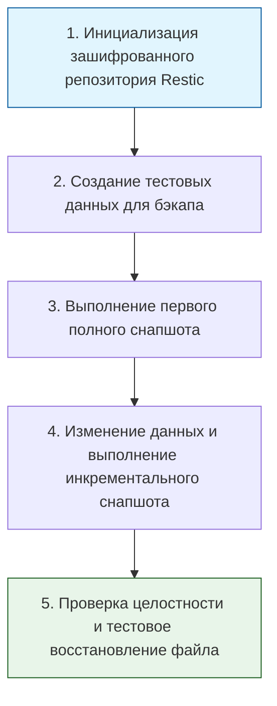

> [!abstract] Обзор главы
> В этой главе изучаются стратегии защиты данных от потери, удаления или шифрования вредоносным ПО. Рассматриваются принципы создания надежных резервных копий, их безопасного хранения и отработанные сценарии быстрого восстановления инфраструктуры после сбоев или катастроф.

| Подпункт | Фокус изучения | Ключевые технологии |
| :--- | :--- | :--- |
| **9.1. Резервное копирование** | Стратегии бэкапов (полные, инкрементальные, дифференциальные), правило 3-2-1, шифрование копий | BorgBackup, Restic, Veeam, rsync, tar, cron |
| **9.2. Аварийное восстановление (DR)** | Цели восстановления (RTO, RPO), гео-резервирование, автоматизация развертывания из бэкапа | Disaster Recovery Plan (DRP), Terraform, Ansible |

---

## 1. 🎯 Суть и цель
Гарантия выживаемости бизнеса и данных при любых инцидентах. Цель — не просто создать копию данных, а убедиться, что эта копия цела, не зашифрована вирусом-вымогателем, и что процесс восстановления из нее отработан и занимает предсказуемое время (RTO), а потеря данных минимальна (RPO).

---

## 2. 📚 Что изучить (Теория)

| Тема | Конкретные вопросы для изучения |
| :--- | :--- |
| **Стратегии и правила бэкапа** | • Правило 3-2-1: 3 копии данных, на 2 разных носителях, 1 копия вне офиса (или в облаке). • Разница между полным, инкрементальным (только изменения с последнего бэкапа) и дифференциальным (изменения с последнего полного бэкапа) копированием. • Дедупликация данных для экономии места. |
| **Метрики восстановления** | • RPO (Recovery Point Objective): максимально допустимый объем потери данных (например, "мы можем потерять данные максимум за последние 15 минут"). • RTO (Recovery Time Objective): максимально допустимое время простоя системы до её полного восстановления. |
| **Безопасность резервных копий** | • Шифрование бэкапов на стороне клиента (до отправки в облако). • Принцип неизменяемости (Immutability): защита копий от удаления или изменения даже пользователем с правами root (защита от ransomware). • Регулярное тестирование восстановления (бэкап, который нельзя восстановить, бесполезен). |

---

## 3. 💻 Практическая задача (Лабораторная работа)

**Название:** Настройка инкрементального шифрованного резервного копирования с помощью Restic  
**Инструменты:** Локальный компьютер (Linux/macOS/WSL), установленный Restic, текстовый редактор.

**Пошаговое выполнение:**
1. **Установка и подготовка:** Установите Restic (`sudo apt install restic`). Создайте папку для репозитория и папку с данными:  
   `mkdir ~/restic-repo ~/backup-data`
2. **Инициализация:** Инициализируйте локальный репозиторий с паролем (пароль будет запрошен и необходим для любых операций):  
   `restic -r ~/restic-repo init`
3. **Создание данных:** Создайте тестовый файл:  
   `echo "Важные данные версии 1" > ~/backup-data/important.txt`
4. **Первый бэкап (полный):** Выполните резервное копирование:  
   `restic -r ~/restic-repo backup ~/backup-data`
5. **Изменение и инкрементальный бэкап:** Измените файл и создайте новый:  
   `echo "Важные данные версии 2" > ~/backup-data/important.txt`  
   `echo "Новый файл" > ~/backup-data/new_file.txt`  
   Снова запустите команду `restic -r ~/restic-repo backup ~/backup-data`. Restic скопирует только изменившиеся блоки (это будет видно по размеру обработанных данных).
6. **Проверка и восстановление:** Посмотрите список снапшотов:  
   `restic -r ~/restic-repo snapshots`  
   Восстановите файл из первого снапшота в отдельную папку, указав его ID:  
   `restic -r ~/restic-repo restore <ID_первого_снапшота> --target ~/restored-data`

---

## 4. ✅ Критерий успеха

| Проверка | Команда для терминала | Ожидаемый результат (Критерий успеха) |
| :--- | :--- | :--- |
| **Создание снапшотов** | `restic -r ~/restic-repo snapshots` | Вывод показывает минимум 2 снапшота с разными временными метками. |
| **Эффективность инкремента** | Сравнение вывода двух команд `backup` | Второй запуск `backup` обрабатывает значительно меньше данных (только новые/измененные байты), чем первый. |
| **Успешное восстановление** | `cat ~/restored-data/home/.../backup-data/important.txt` | Файл содержит текст "Важные данные версии 1", что доказывает возможность точечного отката к предыдущему состоянию. |
| **Проверка целостности** | `restic -r ~/restic-repo check` | Команда завершается без ошибок, подтверждая, что данные в репозитории не повреждены. |

---

## 5. 🗣️ Фраза для собеседования

> «Я подхожу к резервному копированию не как к формальности, а как к гарантированному механизму выживания системы. Я применяю правило 3-2-1, обязательно шифрую бэкапы на стороне клиента и регулярно провожу тестовые восстановления, чтобы убедиться в их работоспособности. Для меня бэкап считается успешным только тогда, когда мы успешно развернули из него данные и уложились в целевые показатели RTO и RPO».
