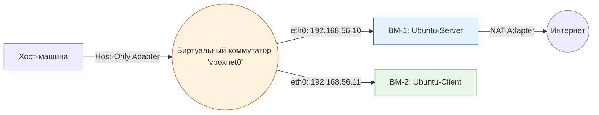

> [!abstract] Обзор главы
> Мы закладываем физический и логический фундамент полигона. Вместо абстрактных команд мы развернем гипервизор, создадим изолированную виртуальную сеть и поднимем две виртуальные машины, чтобы понять, как пакеты перемещаются между ними, прежде чем начинать их автоматизировать.

| Подпункт | Фокус изучения (Инфраструктура + DevSecOps) | Ключевые технологии |
| :--- | :--- | :--- |
| **1.1. Виртуализация** | Разница между Type-1 (Proxmox/ESXi) и Type-2 (VirtualBox) гипервизорами. Выделение ресурсов (CPU, RAM, Disk). | Proxmox VE, VirtualBox, Vagrant |
| **1.2. Виртуальные сети** | Режимы подключения: NAT (доступ в интернет), Host-Only (связь с хостом), Internal Network (полная изоляция ВМ друг от друга). | VirtualBox Network Settings, Proxmox Linux Bridge |
| **1.3. Сетевые протоколы** | Базовый путь пакета: MAC-адреса, IP-адресация, подсети (CIDR), шлюз по умолчанию, DNS. | ping, traceroute, ip addr, ip route |
| **1.4. Базовая ОС** | Первичная инициализация Linux, обновление пакетов, создание пользователя с правами sudo, базовая файловая система. | Ubuntu Server 22.04 LTS, apt, useradd, sudo |

---

## 1. 🎯 Суть и цель
Понимание полного пути от «железа» до приложения. Ты научишься создавать изолированные сетевые сегменты, что является первым и главным правилом безопасности (сегментация). Без этого понимания настройка Docker или Ansible будет похожа на магию, которая ломается при первом же сетевом конфликте.

---

## 2. 📚 Что изучить (Теория)

| Тема | Конкретные вопросы для изучения |
| :--- | :--- |
| **Виртуализация** | • Как гипервизор выделяет виртуальные CPU и RAM. • Почему виртуальная сеть отличается от физической и как работает виртуальный коммутатор (vSwitch). |
| **Сетевая модель** | • Что такое маска подсети (например, `/24` или `255.255.255.0`) и как определить, находятся ли два IP в одной сети. • Роль шлюза (Gateway): почему без него пакеты не выходят за пределы локальной сети. |
| **Базовый Linux** | • Иерархия файловой системы Linux (`/etc` для конфигов, `/var` для логов, `/home` для пользователей). • Управление пакетами: разница между `apt update` (обновление списка) и `apt upgrade` (установка обновлений). |

---

## 3. 💻 Практическая задача (Лабораторная работа)

**Название:** Построение изолированного сетевого полигона с двумя ВМ  
**Инструменты:** VirtualBox (или Proxmox, если есть отдельный ПК), образ Ubuntu Server 22.04 LTS.

**Пошаговое выполнение:**
1. **Создание сети:** В VirtualBox перейди в `File` -> `Tools` -> `Network Manager`. Создай новую сеть `vboxnet0` (Host-Only) с IP-адресом `192.168.56.1` и маской `255.255.255.0`. Отключи встроенный DHCP-сервер (мы настроим IP вручную, это важнее для понимания).
2. **Создание ВМ-1 (Сервер):** 
   - Создай ВМ "Ubuntu-Server" (2 CPU, 2GB RAM, 20GB Disk).
   - В настройках сети добавь **два** адаптера:
     - Адаптер 1: `NAT` (для доступа в интернет, чтобы скачать обновления).
     - Адаптер 2: `Host-Only Adapter`, имя `vboxnet0`.
   - Установи Ubuntu Server. При настройке сети выбери ручной ввод (Manual) для Адаптера 2: IP `192.168.56.10`, маска `24`, шлюз не указываем (или `192.168.56.1`).
3. **Создание ВМ-2 (Клиент):** 
   - Склонируй или создай вторую ВМ "Ubuntu-Client" с такими же настройками сети.
   - Задай ей статический IP на Адаптере 2: `192.168.56.11`, маска `24`.
4. **Проверка связности:** Загрузи обе ВМ.
   - На Сервере выполни: `ip a` (проверь наличие двух интерфейсов, например `enp0s3` и `enp0s8`).
   - На Сервере выполни: `ping 8.8.8.8` (проверка интернета через NAT).
   - На Клиенте выполни: `ping 192.168.56.10` (проверка связи внутри изолированной сети).

---

## 4. ✅ Критерий успеха

| Проверка | Команда для терминала (на ВМ) | Ожидаемый результат (Критерий успеха) |
| :--- | :--- | :--- |
| **Наличие интерфейсов** | `ip a` | Видны два сетевых интерфейса. Один имеет IP вида `10.0.2.x` (NAT), второй `192.168.56.10` (Host-Only). |
| **Доступ в интернет** | `ping -c 3 8.8.8.8` | 3 пакета отправлено, 3 получено, `0% packet loss`. |
| **Внутренняя связность** | `ping -c 3 192.168.56.11` (с Сервера на Клиент) | Успешный ответ от `192.168.56.11`, время отклика < 1 мс. |
| **Изоляция (отсутствие шлюза)** | `ip route` на Сервере | Маршрут по умолчанию (`default via`) ведет только на интерфейс NAT (например, `10.0.2.2`). Трафик в `192.168.56.0/24` ходит напрямую, не пытаясь уйти в интернет. |

---

## 5. 🗣️ Фраза для собеседования

> «При построении инфраструктуры я всегда начинаю с правильной сетевой сегментации и понимания потоков данных. Например, в своих лабораторных и рабочих проектах я разделяю интерфейсы управления, внутренние сервисные сети и внешний доступ, используя статическую адресацию и строгие правила маршрутизации, чтобы минимизировать поверхность атаки и исключить непреднамеренное пересечение трафика».
