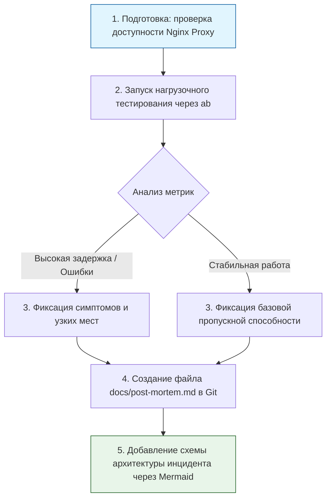

> [!abstract] Обзор главы
> На финальном этапе мы переводим технические достижения на язык бизнеса и надежности. Мы проведем стресс-тестирование нашей инфраструктуры, чтобы найти её пределы, и оформим результаты в виде профессионального отчета (Post-mortem), демонстрируя зрелый инженерный подход, ценимый на позициях Senior и Architect.

| Подпункт | Фокус изучения (Инфраструктура + DevSecOps) | Ключевые технологии |
| :--- | :--- | :--- |
| **10.1. Инженерия надежности (SRE)** | Баланс между скоростью разработки и стабильностью, управление рисками через бюджеты ошибок | SLI (индикаторы), SLO (целевые показатели), Error Budgets |
| **10.2. Нагрузочное тестирование** | Искусственное создание пикового трафика для выявления узких мест (bottlenecks) до реальных пользователей | Apache Bench (`ab`), k6, JMeter, wrk |
| **10.3. Документирование и Post-mortem** | Структурированное описание инцидентов без поиска виноватых (Blameless), визуализация архитектуры | Markdown, Draw.io / Mermaid, Confluence, Notion |

---

## 1. 🎯 Суть и цель
Доказать, что построенная инфраструктура не только функциональна и безопасна, но и предсказуема под нагрузкой. Цель — научиться количественно оценивать надежность системы (через метрики), находить её пределы прочности и грамотно документировать любые отклонения, превращая сбои в возможности для системного улучшения, а не в повод для наказания.

---

## 2. 📚 Что изучить (Теория)

| Тема | Конкретные вопросы для изучения |
| :--- | :--- |
| **Метрики надежности (SRE)** | • Разница между SLA (юридическое соглашение с клиентом), SLO (внутренний целевой показатель, например, 99.9% uptime) и SLI (фактический измеряемый показатель).<br>• Концепция Error Budget (бюджет ошибок): сколько времени или запросов система может позволить себе потерять, чтобы не нарушить SLO. |
| **Метрики производительности** | • RPS/TPS (запросов/транзакций в секунду): пропускная способность.<br>• Latency (задержка): время отклика (часто измеряется через перцентили: p50, p95, p99).<br>• Error Rate: процент неудачных запросов (HTTP 5xx). |
| **Культура Blameless Post-mortem** | • Принципы написания отчета об инциденте: фокус на системных причинах (почему система позволила это сделать?), а не на человеческих ошибках (кто нажал не ту кнопку?).<br>• Обязательные разделы: Timeline (хронология), Impact (влияние на бизнес), Root Cause (корневая причина), Action Items (конкретные задачи с дедлайнами и ответственными). |

---

## 3. 💻 Практическая задача (Лабораторная работа)

**Название:** Нагрузочное тестирование веб-прокси и написание отчета Post-mortem  
**Инструменты:** ВМ-2 (Ubuntu-Client) или хост-машина, утилита `apache2-utils` (содержит `ab`), текстовый редактор.



**Пошаговое выполнение:**
1. **Подготовка инструмента:** На хост-машине или ВМ-2 установите `apache2-utils`:  
   `sudo apt update && sudo apt install apache2-utils -y`
2. **Проведение нагрузочного теста:** Запустите тест, имитирующий резкий всплеск трафика на ваш защищенный прокси (например, 2000 запросов с 100 параллельными соединениями):  
   `ab -n 2000 -c 100 -k https://192.168.56.10/`  
   *(Флаг `-k` включает HTTP Keep-Alive, что ближе к реальному поведению браузера).*
3. **Анализ вывода:** Найдите в результатах ключевые метрики:  
   * `Requests per second`: сколько запросов в секунду выдержал сервер.  
   * `Time per request (mean)`: среднее время отклика в миллисекундах.  
   * `Failed requests`: количество ошибок (должно быть 0 или близко к нему).
4. **Создание отчета Post-mortem:** В вашем Git-репозитории создайте файл `docs/post-mortem.md` и заполните его по шаблону:
   ```markdown
   # Post-mortem: Нагрузочное тестирование Nginx Reverse Proxy
   **Дата:** 2023-10-27  
   **Автор:** [Ваше Имя]  
   **Статус:** Завершено (Учебный инцидент)

   ## 1. Краткое описание
   Проведено стресс-тестирование веб-прокси для определения предельной пропускной способности и проверки устойчивости WAF-правил под нагрузкой.

   ## 2. Метрики теста
   - Целевая нагрузка: 2000 запросов, 100 параллельных соединений.
   - Фактическая пропускная способность: [ВСТАВИТЬ ЧИСЛО] req/sec.
   - Среднее время отклика (p95): [ВСТАВИТЬ ЧИСЛО] ms.
   - Ошибки (Failed requests): [ВСТАВИТЬ ЧИСЛО].

   ## 3. Наблюдения и узкие места
   - [Например: При превышении 500 req/sec время отклика деградировало из-за нехватки воркеров Nginx или ограничений CPU виртуальной машины].
   - Правила WAF успешно отработали, ложных срабатываний на легитимный трафик не зафиксировано.

   ## 4. План действий (Action Items)
   - [ ] Увеличить параметр `worker_processes` и `worker_connections` в конфигурации Nginx.
   - [ ] Настроить алерт в Prometheus/Grafana при превышении `nginx_active_connections` > 80% от лимита.
   - [ ] Добавить автоматическое нагрузочное тестирование в CI/CD пайплайн (например, через k6).
   ```
5. **Финальный коммит:** Добавьте отчет и закройте проект:  
   `git add docs/post-mortem.md && git commit -m "docs: добавить отчет о нагрузочном тестировании и план улучшений" && git push`

---

## 4. ✅ Критерий успеха

| Проверка | Команда / Действие | Ожидаемый результат (Критерий успеха) |
| :--- | :--- | :--- |
| **Успешный тест** | Запуск команды `ab` | Тест завершен, выведены сводные метрики (Time taken, Requests per second, Transfer rate). |
| **Качество отчета** | Просмотр файла `docs/post-mortem.md` в репозитории | Документ содержит все обязательные разделы, цифры взяты из реального вывода утилиты, план действий (Action Items) конкретный и измеримый. |
| **Понимание SRE** | Самостоятельная проверка | Вы можете четко объяснить разницу между высоким `Time per request` (деградация производительности) и ростом `Failed requests` (полный отказ сервиса). |
| **Завершенность проекта** | `git log --oneline` | История коммитов показывает логичную эволюцию проекта от простой ВМ до полноценного DevSecOps-стенда с документацией. |

---

## 5. 🗣️ Фраза для собеседования

> «Я рассматриваю надежность и безопасность как неотъемлемую часть бизнес-процессов. При проектировании систем я закладываю измеримые показатели (SLO) и регулярно провожу нагрузочное тестирование, чтобы находить узкие места до того, как это сделают реальные пользователи. В случае любых сбоев я инициирую написание blameless post-mortem отчетов, чтобы фокусироваться на устранении системных причин проблем и предотвращении их повторения, а не на поиске виноватых».