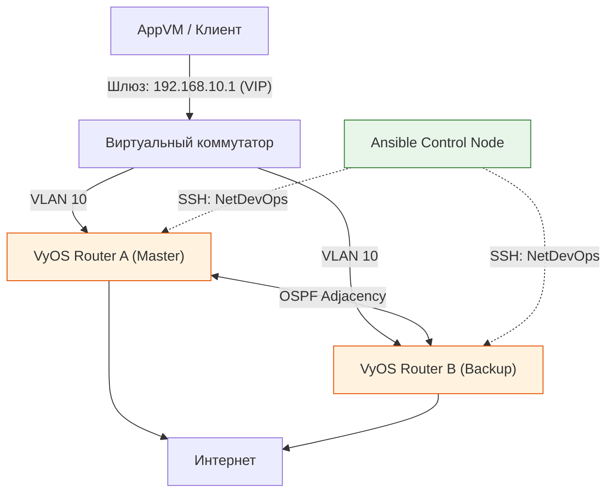

> [!abstract] Обзор главы
> Финальный технический рубеж. Мы переходим от настройки статических маршрутов к проектированию отказоустойчивых корпоративных сетей. Мы научимся автоматизировать конфигурацию сетевых устройств (NetDevOps), обеспечивать бесшовное переключение при авариях (High Availability) и собирать сетевую телеметрию.

| Подпункт                                    | Фокус изучения (Network/Infra Engineer)                                         | Ключевые технологии                               |
| :------------------------------------------ | :------------------------------------------------------------------------------ | :------------------------------------------------ |
| **11.1. Динамическая маршрутизация и HA**   | Протоколы OSPF/BGP, резервирование шлюза по умолчанию, агрегация каналов        | VyOS, FRRouting, VRRP, ECMP                       |
| **11.2. Сетевая автоматизация (NetDevOps)** | Управление сетью как кодом, шаблонизация конфигураций, идемпотентное применение | Ansible (`network_cli`, `vyos.vyos`), Jinja2, Git |
| **11.3. Сетевая телеметрия**                | Мониторинг состояния протоколов, утилизации интерфейсов, анализ задержек        | Prometheus SNMP Exporter, Telegraf, Wireshark     |

---

## 1. 🎯 Суть и цель
Исключить единую точку отказа (SPOF) в сетевой инфраструктуре и человеческий фактор при её настройке. Цель — построить топологию, где выход из строя основного маршрутизатора приводит к переключению трафика менее чем за 1 секунду, а все конфигурации хранятся в Git и применяются автоматически через Ansible.

---

## 2. 📚 Что изучить (Теория)

| Тема | Конкретные вопросы для изучения |
| :--- | :--- |
| **Протоколы высокой доступности** | • Как работает VRRP: выборы Master/Backup на основе приоритета, виртуальный MAC-адрес, отслеживание состояния интерфейсов (track interface).<br>• ECMP (Equal-Cost Multi-Path): как маршрутизатор балансирует трафик по нескольким каналам с одинаковой метрикой. |
| **Динамическая маршрутизация (OSPF)** | • Базовые понятия: Area 0 (Backbone), Router ID, стоимость линка (cost).<br>• Процесс установления соседства (Hello, DBD, LSR, LSU, LACK) и таблица маршрутизации. |
| **NetDevOps практики** | • Почему копирование конфигураций через CLI не масштабируется.<br>• Использование Jinja2 для генерации уникальных конфигов для разных устройств из одного шаблона на основе переменных инвентаря Ansible.<br>• Концепция "Golden Config" и автоматический откат (rollback) при ошибке. |

---

## 3. 💻 Практическая задача (Лабораторная работа)

**Название:** Построение отказоустойчивой сети с VyOS, VRRP и автоматизацией через Ansible  
**Инструменты:** Хост-машина, VirtualBox/Proxmox, образ VyOS (требует всего ~512MB RAM на ВМ), Ansible.



**Пошаговое выполнение:**
1. **Подготовка ВМ:** Создайте две легкие ВМ с ОС VyOS. Подключите их к одной внутренней сети (LAN, например, `192.168.10.0/24`) и одной внешней (NAT/Internet).
2. **Создание Jinja2-шаблона:** На Ansible-хосте создайте файл `vyos_vrrp_ospf.j2`:
   ```jinja2
   set interfaces ethernet eth0 address '{{ lan_ip }}'
   set protocols vrrp group 1 virtual-address '192.168.10.1'
   set protocols vrrp group 1 priority '{{ vrrp_priority }}'
   set protocols ospf area 0 network '{{ lan_network }}'
   ```
3. **Написание Ansible Playbook:** Создайте `network_config.yml`, который использует этот шаблон и переменные из инвентаря:
   ```yaml
   - hosts: vyos_routers
     gather_facts: no
     tasks:
       - name: Генерация и применение конфигурации VyOS
         vyos.vyos.vyos_config:
           src: vyos_vrrp_ospf.j2
           update: merge
           save: yes
   ```
4. **Применение и проверка:** Запустите плейбук. Зайдите на RouterA и выполните `show vrrp` (должен быть `Master`), на RouterB (должен быть `Backup`).
5. **Тест отказоустойчивости:** На AppVM запустите непрерывный пинг: `ping 8.8.8.8`. Находясь на хосте гипервизора, принудительно выключите сетевой интерфейс `eth0` на RouterA (Master). Наблюдайте за пингом.

---

## 4. ✅ Критерий успеха

| Проверка | Команда / Действие | Ожидаемый результат (Критерий успеха) |
| :--- | :--- | :--- |
| **Состояние VRRP** | На VyOS: `show vrrp` | RouterA показывает `State: Master`, RouterB показывает `State: Backup`. Виртуальный IP `192.168.10.1` активен. |
| **Соседство OSPF** | На VyOS: `show ip ospf neighbor` | Статус соседа: `Full`. |
| **Идемпотентность** | Повторный запуск `ansible-playbook network_config.yml` | Статус задач: `ok`. Изменений (`changed`) нет, конфигурация не ломается при повторном применении. |
| **Бесшовный Failover** | Непрерывный `ping 8.8.8.8` при отключении Master-интерфейса | Теряется не более 1-3 эхо-запросов (время сходимости VRRP). Трафик автоматически и прозрачно для пользователя переходит на RouterB. |

---

## 5. 🗣️ Фраза для собеседования

> «При проектировании сетевой инфраструктуры я исхожу из принципа отсутствия единой точки отказа. Я внедряю динамическую маршрутизацию (OSPF) и резервирование шлюза (VRRP) для обеспечения бесшовного переключения при аппаратных сбоях. При этом я исключаю ручные изменения на устройствах, применяя подходы NetDevOps: конфигурации хранятся как код в Git, шаблонизируются через Jinja2 и применяются идемпотентно через Ansible, что гарантирует предсказуемость и возможность мгновенного отката».