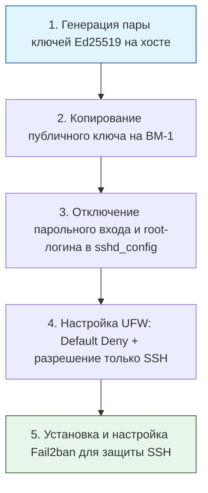

> [!abstract] Обзор главы
> На этом этапе мы выстраиваем эшелонированную защиту нашего полигона. Мы настроим виртуальный периметр, переведем управление на криптографические ключи, закроем все неиспользуемые порты и внедрим механизмы автоматической блокировки подозрительной активности.

| Подпункт | Фокус изучения (Инфраструктура + DevSecOps) | Ключевые технологии |
| :--- | :--- | :--- |
| **2.1. Управление доступом** | Отказ от парольной аутентификации, принцип минимальных привилегий, защита учетной записи root | SSH-ключи (Ed25519), `sshd_config`, `sudo`, `visudo` |
| **2.2. Сетевой периметр (Firewall)** | Политика «запрещено по умолчанию» (Default Deny), stateful-фильтрация, сегментация трафика | UFW, iptables/nftables, (опционально: PfSense/OPNsense) |
| **2.3. Защита от перебора** | Мониторинг логов в реальном времени, автоматический бан IP-адресов при аномальной активности | Fail2ban, регулярные выражения (Regex) для парсинга логов |

---

## 1. 🎯 Суть и цель
Сведение к минимуму поверхности атаки (Attack Surface) на уровне операционной системы и сети. Цель — гарантировать, что даже при утечке учетных данных злоумышленник не сможет войти в систему, а любые попытки сканирования или подбора паролей будут автоматически заблокированы и залогированы, не создавая нагрузки на основные сервисы.

---

## 2. 📚 Что изучить (Теория)

| Тема | Конкретные вопросы для изучения |
| :--- | :--- |
| **Аутентификация по ключам** | • Криптография с открытым ключом: как работает пара приватный/публичный ключ (Ed25519 предпочтительнее RSA).<br>• Файл `~/.ssh/authorized_keys`: формат записи, права доступа (600 для файла, 700 для директории `.ssh`). |
| **Принципы работы Firewall** | • Разница между фильтрацией на 3-м (IP) и 4-м (TCP/UDP порты) уровнях модели OSI.<br>• Концепция Stateful Inspection: фаервол запоминает состояние соединения и автоматически разрешает возвратный трафик для установленных сессий. |
| **Механика Fail2ban** | • Архитектура: фильтры (парсинг логов через regex) и действия (actions, например, добавление правила в iptables).<br>• Понятие "мягкого" (soft) и "жесткого" (hard) бана, время разбана (bantime) и порог срабатывания (maxretry). |

---

## 3. 💻 Практическая задача (Лабораторная работа)

**Название:** Hardening целевой ВМ: SSH-ключи, строгий UFW и Fail2ban  
**Инструменты:** Хост-машина (терминал), ВМ-1 (Ubuntu-Server из Главы 1).



**Пошаговое выполнение:**
1. **Генерация ключей (на хост-машине):**  
   `ssh-keygen -t ed25519 -C "admin@devsecops-lab" -f ~/.ssh/lab_key`  
   *(Нажмите Enter, чтобы не ставить парольную фразу на ключ, или задайте её для дополнительной безопасности).*
2. **Копирование ключа:**  
   `ssh-copy-id -i ~/.ssh/lab_key.pub user@192.168.56.10`  
   *(Введите пароль пользователя последний раз).*
3. **Hardening SSH (на ВМ-1):**  
   Откройте `/etc/ssh/sshd_config` и измените/раскомментируйте следующие строки:  
   ```text
   PermitRootLogin no
   PasswordAuthentication no
   PubkeyAuthentication yes
   ```  
   Перезапустите службу: `sudo systemctl restart sshd`.
4. **Настройка межсетевого экрана (на ВМ-1):**  
   ```bash
   sudo ufw default deny incoming
   sudo ufw default allow outgoing
   sudo ufw allow from 192.168.56.0/24 to any port 22 proto tcp # Разрешаем SSH только из нашей внутренней сети
   sudo ufw enable
   ```
5. **Внедрение Fail2ban (на ВМ-1):**  
   ```bash
   sudo apt update && sudo apt install fail2ban -y
   sudo cp /etc/fail2ban/jail.conf /etc/fail2ban/jail.local
   ```  
   Отредактируйте `/etc/fail2ban/jail.local`, найдите секцию `[sshd]` и убедитесь, что она активна:  
   ```ini
   [sshd]
   enabled = true
   port = ssh
   filter = sshd
   logpath = /var/log/auth.log
   maxretry = 3
   bantime = 1h
   ```  
   Перезапустите службу: `sudo systemctl restart fail2ban`.

---

## 4. ✅ Критерий успеха

| Проверка | Команда для терминала | Ожидаемый результат (Критерий успеха) |
| :--- | :--- | :--- |
| **Вход по ключу** | `ssh -i ~/.ssh/lab_key user@192.168.56.10` | Успешный вход без запроса пароля. |
| **Запрет входа по паролю** | Попытка входа с другой машины или с ключом `-o PubkeyAuthentication=no` | Отказ в доступе: `Permission denied (publickey)`. |
| **Статус Firewall** | `sudo ufw status verbose` | Вывод показывает `Default: deny (incoming), allow (outgoing)` и разрешенный порт 22 только для подсети `192.168.56.0/24`. |
| **Активность Fail2ban** | `sudo fail2ban-client status sshd` | Вывод показывает `Status of the jail: sshd`, `Filter` активно, `Currently banned: 0` (или больше, если вы специально ошиблись при вводе пароля до отключения парольного входа). |

---

## 5. 🗣️ Фраза для собеседования

> «При настройке любого нового сервера я применяю принцип "Default Deny" и минимальных привилегий. Я сразу отключаю аутентификацию по паролям в пользу SSH-ключей, ограничиваю доступ к порту 22 только с доверенных подсетей через UFW/iptables и разворачиваю Fail2ban для автоматического отражения brute-force атак, что значительно снижает поверхность атаки на этапе первичного развертывания».