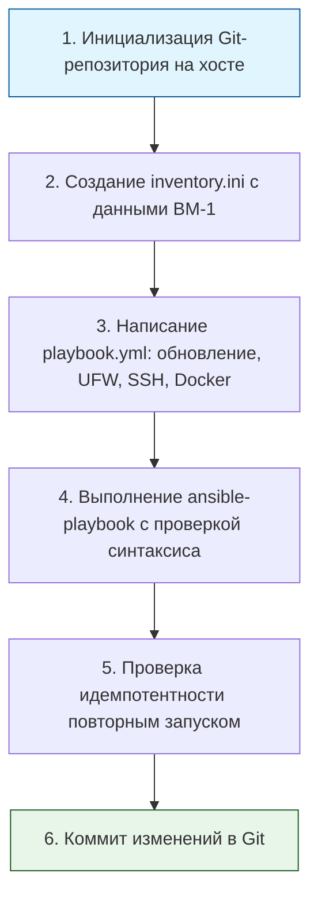

> [!abstract] Обзор главы
> На этом этапе мы отказываемся от ручной настройки серверов через SSH-терминал. Вся конфигурация, настроенная в предыдущих главах, переводится в декларативный код (Ansible Playbooks) и сохраняется в системе контроля версий (Git). Это гарантирует идемпотентность (повторяемость) и возможность мгновенного развертывания идентичных узлов.

| Подпункт | Фокус изучения (Инфраструктура + DevSecOps) | Ключевые технологии |
| :--- | :--- | :--- |
| **3.1. Управление конфигурациями** | Декларативное описание желаемого состояния системы, идемпотентность, модульная структура | Ansible, YAML, Inventory, Playbooks, Roles |
| **3.2. Контроль версий (IaC)** | Хранение инфраструктуры как кода, ветвление, код-ревью конфигураций перед применением | Git, GitHub/GitLab, `.gitignore` |
| **3.3. Скриптовая автоматизация** | Написание вспомогательных скриптов для обвязки процессов, парсинга вывода или подготовки окружения | Bash, Python (базовый синтаксис, работа с файлами) |

---

## 1. 🎯 Суть и цель
Исключение человеческого фактора (drift configuration) из процесса эксплуатации. Цель — добиться того, чтобы развертывание нового сервера или применение политик безопасности занимало минуты и выполнялось одной командой, а вся история изменений инфраструктуры была прозрачной и хранилась в Git.

---

## 2. 📚 Что изучить (Теория)

| Тема | Конкретные вопросы для изучения |
| :--- | :--- |
| **Архитектура Ansible** | • Принцип работы без агентов (agentless) через SSH.<br>• Компоненты: Control Node, Managed Nodes, Inventory (статический и динамический), Modules, Playbooks.<br>• Концепция идемпотентности: почему повторный запуск плейбука не должен ломать систему или менять то, что уже соответствует желаемому состоянию. |
| **Синтаксис YAML и Jinja2** | • Правила форматирования YAML (отступы пробелами, списки, словари).<br>• Использование переменных (`{{ var_name }}`) и шаблонов Jinja2 для динамической генерации конфигурационных файлов. |
| **Best Practices в Ansible** | • Использование `become: yes` для повышения привилегий.<br>• Обработка ошибок (`ignore_errors`, `failed_when`).<br>• Использование `handlers` для перезапуска служб только при изменении конфигурации. |

---

## 3. 💻 Практическая задача (Лабораторная работа)

**Название:** Автоматизация hardening и установки Docker на целевую ВМ с помощью Ansible  
**Инструменты:** Хост-машина (установлен Ansible и Git), ВМ-1 (Ubuntu-Server из предыдущих глав).



**Пошаговое выполнение:**
1. **Подготовка окружения (на хосте):**  
   Установите Ansible (например, `sudo apt install ansible` или `pipx install ansible`).  
   Создайте директорию проекта и инициализируйте Git:  
   `mkdir devsecops-lab && cd devsecops-lab && git init`
2. **Создание инвентаря:**  
   Создайте файл `inventory.ini`:  
   ```ini
   [webservers]
   target_vm ansible_host=192.168.56.10 ansible_user=ваш_пользователь ansible_ssh_private_key_file=~/.ssh/lab_key
   ```
3. **Написание Playbook:**  
   Создайте файл `site.yml`:  
   ```yaml
   ---
   - name: Базовая настройка и защита сервера
     hosts: webservers
     become: yes
     gather_facts: yes

     tasks:
       - name: Обновление кэша apt и установка обновлений безопасности
         apt:
           update_cache: yes
           upgrade: safe
         register: apt_update

       - name: Установка необходимых пакетов
         apt:
           name: ['ufw', 'fail2ban', 'docker.io', 'docker-compose']
           state: present

       - name: Настройка UFW (Default deny и разрешение SSH)
         ufw:
           rule: allow
           port: '22'
           proto: tcp
           from_ip: '192.168.56.0/24'
         notify: Enable UFW

       - name: Запуск и включение Docker
         service:
           name: docker
           state: started
           enabled: yes

     handlers:
       - name: Enable UFW
         ufw:
           state: enabled
           policy: deny
           direction: incoming
   ```
4. **Проверка и запуск:**  
   Проверьте синтаксис: `ansible-playbook -i inventory.ini site.yml --syntax-check`  
   Запустите выполнение: `ansible-playbook -i inventory.ini site.yml`
5. **Проверка идемпотентности:**  
   Запустите ту же команду `ansible-playbook` второй раз.
6. **Фиксация в Git:**  
   `git add inventory.ini site.yml`  
   `git commit -m "feat: добавить базовый playbook для hardening и установки docker"`

---

## 4. ✅ Критерий успеха

| Проверка | Команда для терминала | Ожидаемый результат (Критерий успеха) |
| :--- | :--- | :--- |
| **Успешное выполнение** | `ansible-playbook -i inventory.ini site.yml` (первый запуск) | Все задачи завершаются со статусом `ok` или `changed`. Ошибок (`failed`) нет. |
| **Идемпотентность** | `ansible-playbook -i inventory.ini site.yml` (второй запуск) | Все задачи завершаются со статусом `ok`. Статус `changed` отсутствует (Ansible понял, что система уже в нужном состоянии). |
| **Состояние сервисов** | `ssh -i ~/.ssh/lab_key user@192.168.56.10 "systemctl is-active docker ufw"` | Вывод: `active` для обеих служб. |
| **Версионирование** | `git log --oneline` | В истории есть коммит с понятным сообщением, описывающим внесенные изменения в инфраструктуру. |

---

## 5. 🗣️ Фраза для собеседования

> «Я исключаю дрейф конфигураций и человеческий фактор, применяя подход Infrastructure as Code. Вместо ручной настройки я описываю желаемое состояние сервера в идемпотентных Ansible-плейбуках, храню их в Git и применяю централизованно. Это гарантирует, что любой новый узел будет развернут с идентичными настройками безопасности за минуты, а история изменений полностью прозрачна».