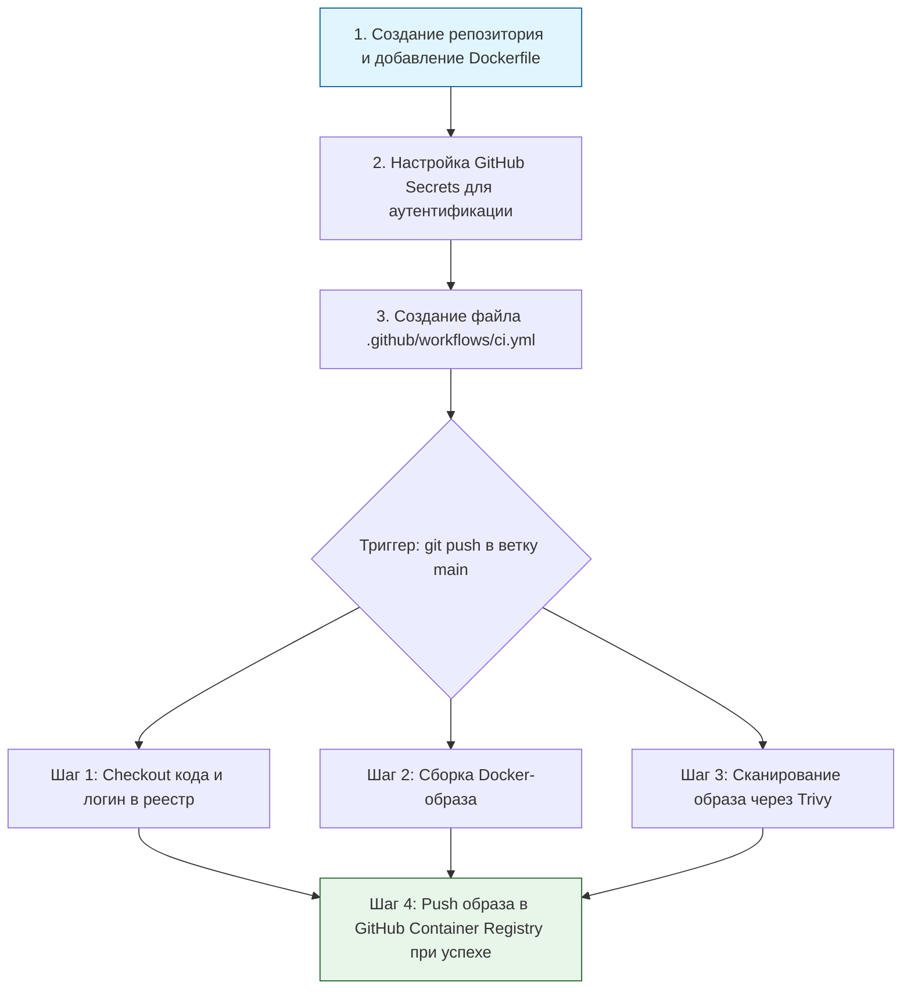

> [!abstract] Обзор главы
> На этом этапе мы автоматизируем процесс создания и проверки артефактов (образов контейнеров). Мы переносим проверки безопасности «влево» (Shift-Left), внедряя автоматическое сканирование на уязвимости прямо в процесс сборки, чтобы небезопасный код физически не мог попасть в среду развертывания.

| Подпункт                                  | Фокус изучения (Инфраструктура + DevSecOps)                                                                               | Ключевые технологии                                     |
| :---------------------------------------- | :------------------------------------------------------------------------------------------------------------------------ | :------------------------------------------------------ |
| **4.1. Основы CI/CD пайплайнов**          | Этапы сборки (build), тестирования (test) и публикации (publish), триггеры запуска (push, pull request)                   | GitHub Actions, GitLab CI/CD, YAML-синтаксис workflows  |
| **4.2. Безопасность в CI/CD (DevSecOps)** | Управление секретами (токенами, паролями), статический анализ кода (SAST), сканирование образов контейнеров на уязвимости | GitHub Secrets, Trivy, Hadolint (линтер для Dockerfile) |
| **4.3. Реестры артефактов**               | Версионирование, хранение и защита собранных образов, политики удаления устаревших версий                                 | GitHub Container Registry (GHCR), Docker Hub, Harbor    |

---

## 1. 🎯 Суть и цель
Исключение ручного процесса сборки и проверки образов, который подвержен ошибкам и человеческому фактору. Цель — создать конвейер, который при каждом изменении кода автоматически собирает образ, проверяет его на известные уязвимости (CVE) и плохие практики, и только в случае успеха публикует его в защищенный реестр с уникальным тегом версии.

---

## 2. 📚 Что изучить (Теория)

| Тема | Конкретные вопросы для изучения |
| :--- | :--- |
| **Архитектура пайплайнов** | • Понятие джоб (jobs) и шагов (steps) в CI-системах.<br>• Разница между Continuous Integration (непрерывная интеграция кода) и Continuous Delivery (непрерывная доставка артефактов).<br>• Использование матриц сборки для тестирования на разных версиях ОС или языков. |
| **DevSecOps в сборке** | • Почему хранение паролей и токенов в коде (hardcoding) недопустимо и как использовать переменные окружения (Secrets).<br>• Принцип работы сканеров уязвимостей: сравнение установленных в образе пакетов с базами данных CVE (National Vulnerability Database). |
| **Управление версиями образов** | • Семантическое версионирование (SemVer) vs использование хеша коммита (Git SHA) для тегирования образов.<br>• Почему использование тега `latest` в продакшене считается антипаттерном (невозможность точного отката). |

---

## 3. 💻 Практическая задача (Лабораторная работа)

**Название:** Создание защищенного CI/CD пайплайна для сборки и сканирования Docker-образа  
**Инструменты:** Аккаунт на GitHub, локальный компьютер с Git, текстовый редактор.



**Пошаговое выполнение:**
1. **Подготовка репозитория:** Создайте новый публичный репозиторий на GitHub (например, `devsecops-lab`). Клонируйте его локально. Создайте файл `Dockerfile` (можно использовать простой Nginx из Главы 1):
   ```dockerfile
   FROM nginx:alpine
   COPY nginx.conf /etc/nginx/nginx.conf
   # Явное указание непривилегированного пользователя
   USER nginx
   EXPOSE 8080
   ```
2. **Настройка аутентификации:** В настройках репозитория на GitHub перейдите в `Settings` -> `Secrets and variables` -> `Actions`. Создайте новый репозиторный секрет с именем `CR_PAT` (Classic Personal Access Token), который вы предварительно создали в настройках своего профиля GitHub с правами `write:packages` и `read:packages`.
3. **Создание пайплайна:** Создайте директорию `.github/workflows` и в ней файл `ci.yml`:
   ```yaml
   name: Secure Docker Build and Scan

   on:
     push:
       branches: [ "main" ]

   env:
     REGISTRY: ghcr.io
     IMAGE_NAME: ${{ github.repository }}

   jobs:
     build-and-scan:
       runs-on: ubuntu-latest
       permissions:
         contents: read
         packages: write

       steps:
         - name: Checkout кода
           uses: actions/checkout@v4

         - name: Логин в Container Registry
           uses: docker/login-action@v3
           with:
             registry: ${{ env.REGISTRY }}
             username: ${{ github.actor }}
             password: ${{ secrets.CR_PAT }}

         - name: Сборка Docker-образа
           run: docker build -t ${{ env.REGISTRY }}/${{ env.IMAGE_NAME }}:${{ github.sha }} .

         - name: Сканирование образа на уязвимости (Trivy)
           uses: aquasecurity/trivy-action@master
           with:
             image-ref: '${{ env.REGISTRY }}/${{ env.IMAGE_NAME }}:${{ github.sha }}'
             format: 'table'
             exit-code: '1' # Заставляет пайплайн упасть с ошибкой, если найдены уязвимости
             ignore-unfixed: true
             severity: 'CRITICAL,HIGH'

         - name: Публикация образа в реестр
           run: docker push ${{ env.REGISTRY }}/${{ env.IMAGE_NAME }}:${{ github.sha }}
   ```
4. **Запуск:** Сделайте коммит и отправьте код в репозиторий:  
   `git add . && git commit -m "feat: добавить CI/CD пайплайн со сканированием Trivy" && git push origin main`

---

## 4. ✅ Критерий успеха

| Проверка | Действие | Ожидаемый результат (Критерий успеха) |
| :--- | :--- | :--- |
| **Успешный запуск пайплайна** | Вкладка "Actions" в репозитории GitHub | Видна успешная сборка (зеленая галочка) с именем "Secure Docker Build and Scan". Все шаги завершены статусом `Completed`. |
| **Работа сканера безопасности** | Просмотр логов шага "Сканирование образа на уязвимости (Trivy)" | В логах виден вывод таблицы Trivy. Если критических уязвимостей нет, шаг завершается успешно. *(Для проверки: намеренно измените Dockerfile на `FROM nginx:1.14`, чтобы увидеть, как пайплайн падает с красной ошибкой из-за старых CVE).* |
| **Наличие артефакта** | Переход в `Settings` -> `Packages` в профиле GitHub | В списке пакетов появился новый образ с тегом, соответствующим хешу вашего последнего коммита (`${{ github.sha }}`). |

---

## 5. 🗣️ Фраза для собеседования

> «Я выстраиваю процесс доставки артефактов по принципам DevSecOps, внедряя проверки безопасности непосредственно в CI/CD пайплайн. Например, сборка образа неразрывно связана с автоматическим сканированием через Trivy: если инструмент обнаруживает критические уязвимости, пайплайн прерывается, что физически блокирует попадание небезопасного кода в реестр и далее в продакшн-окружение».