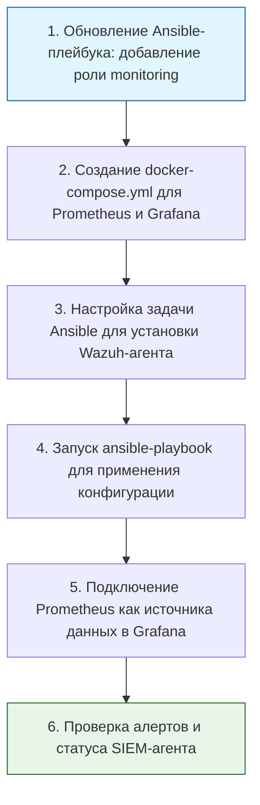

> [!abstract] Обзор главы
> На этом этапе мы превращаем нашу инфраструктуру из "черного ящика" в полностью наблюдаемую систему. Мы развернем сбор метрик производительности и внедрим SIEM-агент для централизованного анализа событий безопасности, чтобы узнавать о проблемах и атаках раньше, чем они нанесут ущерб.

| Подпункт | Фокус изучения (Инфраструктура + DevSecOps) | Ключевые технологии |
| :--- | :--- | :--- |
| **5.1. Мониторинг метрик** | Сбор числовых данных во времени (CPU, RAM, Disk), алертинг при превышении порогов | Prometheus, Grafana, Node Exporter, PromQL |
| **5.2. Централизованное логирование** | Агрегация текстовых записей событий (логов) со всех узлов в одно место для быстрого поиска причин сбоев | Loki, Promtail, или легковесный ELK-стек |
| **5.3. SIEM и детектирование угроз** | Корреляция событий безопасности, преобразование сырых логов в структурированные алерты по правилам | Wazuh (Open Source SIEM/XDR), агенты сбора событий |

---

## 1. 🎯 Суть и цель
Переход от реактивного "тушения пожаров" к проактивному управлению инфраструктурой. Цель — иметь единую панель управления (Dashboard), где видны как технические сбои (закончилось место на диске), так и инциденты безопасности (множественные неудачные попытки входа по SSH), с автоматическими уведомлениями в мессенджер или на почту.

---

## 2. 📚 Что изучить (Теория)

| Тема | Конкретные вопросы для изучения |
| :--- | :--- |
| **Архитектура мониторинга** | • Разница между метриками (числа, тренды) и логами (текст, события).<br>• Pull-модель Prometheus: сервер сам опрашивает целевые узлы (targets) через HTTP-эндпоинты (экспортеры).<br>• Основы языка запросов PromQL (например, `rate(node_cpu_seconds_total{mode="idle"}[5m])`). |
| **Принципы работы SIEM** | • Этапы обработки данных: Сбор (Collection) → Нормализация (Normalization) → Корреляция (Correlation) → Оповещение (Alerting).<br>• Как SIEM отличает легитимную активность администратора от брутфорс-атаки (анализ частоты событий за единицу времени). |
| **Алертинг и маршрутизация** | • Настройка правил в Alertmanager: группировка похожих алертов, подавление дубликатов (silencing), отправка уведомлений в Telegram/Slack/Webhook. |

---

## 3. 💻 Практическая задача (Лабораторная работа)

**Название:** Автоматизированное развертывание стека Prometheus + Grafana и установка SIEM-агента через Ansible  
**Инструменты:** Хост-машина (Ansible), ВМ-1 (Ubuntu-Server).



**Пошаговое выполнение:**
1. **Подготовка файлов на хосте:** В вашем репозитории `devsecops-lab` создайте директорию `monitoring/` и в ней файл `docker-compose.yml`:
   ```yaml
   version: '3.8'
   services:
     prometheus:
       image: prom/prometheus:latest
       container_name: prometheus
       ports:
         - "9090:9090"
       volumes:
         - ./prometheus.yml:/etc/prometheus/prometheus.yml
       command:
         - '--config.file=/etc/prometheus/prometheus.yml'
     
     grafana:
       image: grafana/grafana:latest
       container_name: grafana
       ports:
         - "3000:3000"
       environment:
         - GF_SECURITY_ADMIN_PASSWORD=admin123 # Смените на сложный пароль в продакшене
   ```
   Создайте там же файл `prometheus.yml`:
   ```yaml
   global:
     scrape_interval: 15s
   scrape_configs:
     - job_name: 'prometheus'
       static_configs:
         - targets: ['localhost:9090']
     - job_name: 'node_exporter'
       static_configs:
         - targets: ['localhost:9100'] # Будет работать, если установить node_exporter
   ```
2. **Обновление Ansible Playbook (`site.yml`):** Добавьте новые задачи в конец вашего плейбука:
   ```yaml
       - name: Копирование файлов мониторинга на сервер
         copy:
           src: monitoring/
           dest: /opt/monitoring/
           owner: root
           group: root
           mode: '0755'

       - name: Запуск стека мониторинга через Docker Compose
         community.docker.docker_compose_v2:
           project_src: /opt/monitoring/
           state: present

       - name: Установка Wazuh-агента (упрощенно через apt для демо)
         apt:
           name: wazuh-agent
           state: present
         notify: Restart Wazuh Agent
         
       - name: Включение и запуск Wazuh-агента
         service:
           name: wazuh-agent
           state: started
           enabled: yes

     handlers:
       # ... предыдущие хендлеры ...
       - name: Restart Wazuh Agent
         service:
           name: wazuh-agent
           state: restarted
   ```
   *(Примечание: Для реальной установки Wazuh-агента требуется добавление репозитория Wazuh, но для базового понимания достаточно знать, что агент устанавливается и отправляет логи на центральный сервер Wazuh Manager).*
3. **Применение конфигурации:**  
   `ansible-playbook -i inventory.ini site.yml`
4. **Настройка Grafana:** Откройте в браузере `http://192.168.56.10:3000` (логин: `admin`, пароль: `admin123`). Перейдите в `Connections` -> `Data sources` -> `Add data source` -> `Prometheus`. Укажите URL: `http://prometheus:9090` и нажмите "Save & test".

---

## 4. ✅ Критерий успеха

| Проверка | Команда для терминала / Действие | Ожидаемый результат (Критерий успеха) |
| :--- | :--- | :--- |
| **Работа контейнеров** | `ssh -i ~/.ssh/lab_key user@192.168.56.10 "docker ps"` | В выводе присутствуют контейнеры `prometheus` и `grafana` со статусом `Up`. |
| **Доступность метрик** | Открыть `http://192.168.56.10:9090/targets` | Статус всех endpoints (например, `node_exporter`, если добавлен) — `UP` (зеленый). |
| **Визуализация в Grafana** | Создание панели в Grafana с запросом `node_memory_MemAvailable_bytes` | График отображает доступную память ВМ в реальном времени. |
| **Статус SIEM-агента** | `sudo systemctl status wazuh-agent` | Служба активна (`active (running)`), в логах (`/var/ossec/logs/ossec.log`) нет критических ошибок подключения. |

---

## 5. 🗣️ Фраза для собеседования

> «Я выстраиваю наблюдаемость инфраструктуры, четко разделяя сбор метрик и логов. Для производительности я использую связку Prometheus и Grafana с настроенным алертингом, а для безопасности внедряю SIEM-агенты (например, Wazuh), которые нормализуют сырые логи ОС и приложений. Это позволяет мне видеть не просто факт сбоя, а его первопричину, и автоматически детектировать аномалии, такие как брутфорс-атаки, до того, как они приведут к компрометации».