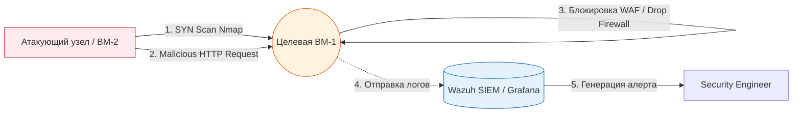

> [!abstract] Обзор главы
> На этом этапе мы переходим от пассивной настройки защиты к активной проверке её эффективности. Мы выступим в роли злоумышленника, чтобы проверить, действительно ли настроенные ранее межсетевые экраны, WAF и SIEM-системы выполняют свои функции и генерируют корректные оповещения.

| Подпункт | Фокус изучения (Инфраструктура + DevSecOps) | Ключевые технологии |
| :--- | :--- | :--- |
| **7.1. Разведка и сканирование** | Определение открытых портов, версий сервисов и обход базовых правил фильтрации | Nmap (флаги `-sS`, `-sV`, `-sC`), Masscan |
| **7.2. Анализ сетевого трафика** | Перехват и глубокий разбор пакетов (PCAP), выявление аномалий в рукопожатиях и полезной нагрузке | tcpdump, Wireshark, tshark |
| **7.3. Валидация средств защиты** | Проверка срабатывания правил WAF и корреляционных правил SIEM на тестовые атаки | Wazuh Dashboard, кастомные payloads (SQLi, XSS) |

---

## 1. 🎯 Суть и цель
Подтверждение работоспособности эшелонированной защиты (Defense in Depth). Цель — не просто настроить инструменты безопасности, а эмпирически доказать, что они блокируют атаки и, что не менее важно, фиксируют эти попытки в логах для последующего расследования, выявляя «слепые зоны» в мониторинге.

---

## 2. 📚 Что изучить (Теория)

| Тема | Конкретные вопросы для изучения |
| :--- | :--- |
| **Методы сканирования Nmap** | • Разница между TCP Connect scan (`-sT`, виден в логах ОС) и SYN stealth scan (`-sS`, не завершает рукопожатие, сложнее детектируется). • Определение версии сервиса (`-sV`) по косвенным признакам (баннеры, поведение при нестандартных запросах). |
| **Анализ PCAP-дампов** | • Структура TCP-сегмента: флаги SYN, ACK, FIN, RST и то, как по ним определить сканирование или обрыв соединения. • Фильтрация в Wireshark/tshark: как изолировать трафик конкретного IP или порта из огромного потока данных. |
| **MITRE ATT&CK и детектирование** | • Понимание тактик и техник атак (например, T1046 - Network Service Scanning). • Как SIEM преобразует сырые логи (например, запись в `auth.log` или `nginx access.log`) в структурированный алерт с уровнем серьезности (Severity). |

---

## 3. 💻 Практическая задача (Лабораторная работа)

**Название:** Комплексный аудит стенда: сканирование, перехват трафика и проверка алертов SIEM  
**Инструменты:** ВМ-2 (Ubuntu-Client из Главы 1) или хост-машина, Nmap, tcpdump, доступ к веб-интерфейсу Wazuh/Grafana.

**Пошаговое выполнение:**
1. **Запуск перехвата трафика (на Целевой ВМ-1):**  
   Начните запись сетевого трафика на портах 22 и 443 в файл для последующего анализа:  
   `sudo tcpdump -i any -w /tmp/audit_scan.pcap 'port 22 or port 443'`
2. **Сканирование периметра (с ВМ-2 или Хоста):**  
   Выполните скрытое SYN-сканирование и определение версий:  
   `nmap -sS -sV -p 22,80,443,8080 192.168.56.10`
3. **Имитация атаки на приложение:**  
   Попробуйте обойти защиту, отправив запрос с SQL-инъекцией (который мы блокировали в Главе 6):  
   `curl -k "https://192.168.56.10/?id=1 UNION SELECT password FROM users"`
4. **Остановка перехвата и анализ:**  
   Остановите `tcpdump` (Ctrl+C). Проанализируйте дамп, отфильтровав только SYN-пакеты:  
   `tcpdump -r /tmp/audit_scan.pcap -n 'tcp[tcpflags] == tcp-syn'`
5. **Проверка SIEM:**  
   Откройте дашборд Wazuh (или Grafana, если настроен сбор логов Nginx). Найдите алерты за последние 15 минут. Ищите события с правилами, связанными с "Ports scan", "Web attack" или "SQL injection".

---

## 4. ✅ Критерий успеха

| Проверка | Команда / Действие | Ожидаемый результат (Критерий успеха) |
| :--- | :--- | :--- |
| **Точность сканирования** | Вывод команды `nmap` | Показывает порты 22 и 443 как `open`, а 80 и 8080 как `filtered` или `closed` (благодаря правилам UFW и Nginx). Версия Nginx не определена. |
| **Наличие сетевого следа** | Вывод `tcpdump -r /tmp/audit_scan.pcap` | Видны входящие SYN-пакеты от IP-адреса атакующего узла к портам 22 и 443. |
| **Блокировка атаки** | Вывод команды `curl` | Возвращает `403 Forbidden` (работа WAF из Главы 6). |
| **Детектирование в SIEM** | Проверка интерфейса Wazuh/Grafana | Присутствует минимум один алерт уровня Warning или выше, классифицирующий активность как сканирование портов или попытку веб-атаки. |

---

## 5. 🗣️ Фраза для собеседования

> «Я не полагаюсь слепо на настроенные средства защиты, а регулярно проверяю их эффективность методами, близкими к пентесту. Например, я запускаю тестовое сканирование Nmap и отправляю проверочные payloads на WAF, а затем проверяю, корректно ли эти события детектируются и коррелируются в SIEM. Это позволяет мне находить слепые зоны в мониторинге и закрывать их до того, как ими воспользуются реальные злоумышленники».