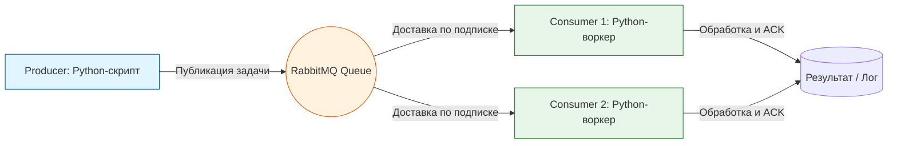

> [!abstract] Обзор главы
> На этом этапе мы переходим от монолитных приложений к распределенным микросервисам, взаимодействующим асинхронно. Мы внедрим брокер сообщений для буферизации нагрузки и разделим приложение на независимые компоненты, что повысит отказоустойчивость и масштабируемость системы.

| Подпункт | Фокус изучения (Инфраструктура + DevSecOps) | Ключевые технологии |
| :--- | :--- | :--- |
| **8.1. Брокеры сообщений** | Асинхронная коммуникация, гарантия доставки, паттерны Pub/Sub и Point-to-Point, обработка сбоев | RabbitMQ, Apache Kafka, Redis Streams |
| **8.2. Контейнеризация микросервисов** | Изоляция зависимостей каждого сервиса, оркестрация многоконтейнерных приложений | Docker Compose, Dockerfile (multi-stage builds) |
| **8.3. Балансировка нагрузки** | Распределение входящего трафика между несколькими экземплярами воркеров или сервисов | HAProxy, Nginx (Upstream), Layer 4 vs Layer 7 балансировка |

---

## 1. 🎯 Суть и цель
Обеспечение высокой доступности и устойчивости к пиковым нагрузкам. Цель — развязать (decouple) компоненты системы так, чтобы сбой или перегрузка одного сервиса (например, обработчика тяжелых задач) не приводила к падению всего приложения, а задачи надежно сохранялись в очереди до момента их обработки.

---

## 2. 📚 Что изучить (Теория)

| Тема | Конкретные вопросы для изучения |
| :--- | :--- |
| **Архитектура очередей сообщений** | • Различия между очередями задач (RabbitMQ, акцент на гарантированной доставке и маршрутизации) и потоковыми платформами (Kafka, акцент на хранении и повторном чтении событий).<br>• Понятие идемпотентности обработчика: почему один и тот же сообщение может быть доставлено дважды, и как код должен это корректно обрабатывать.<br>• Механизм Dead Letter Queue (DLQ) для изоляции сообщений, которые не могут быть обработаны. |
| **Микросервисные паттерны** | • Слабая связность (Loose Coupling): сервисы общаются только через четко определенные API или очереди, не зная о внутренней реализации друг друга.<br>• Паттерн Circuit Breaker (Предохранитель): предотвращение каскадных сбоев при недоступности зависимого сервиса. |
| **Балансировка нагрузки** | • Алгоритмы балансировки: Round Robin, Least Connections, IP Hash.<br>• Разница между балансировкой на транспортном уровне (L4, по IP:порт) и прикладном уровне (L7, по HTTP-заголовкам или пути URL). |

---

## 3. 💻 Практическая задача (Лабораторная работа)

**Название:** Развертывание асинхронной связки Producer-RabbitMQ-Consumer через Docker Compose  
**Инструменты:** Хост-машина или ВМ-1, Docker, Docker Compose, Python.



**Пошаговое выполнение:**
1. **Создание структуры проекта:** На хост-машине создайте директорию `microservices-lab` и в ней файлы `producer.py`, `consumer.py` и `docker-compose.yml`.
2. **Написание Producer (`producer.py`):**
   ```python
   import pika, sys
   # Подключение к RabbitMQ
   connection = pika.BlockingConnection(pika.ConnectionParameters('rabbitmq'))
   channel = connection.channel()
   # Объявление долговечной очереди
   channel.queue_declare(queue='task_queue', durable=True)
   
   message = ' '.join(sys.argv[1:]) or "Hello World!"
   channel.basic_publish(
       exchange='',
       routing_key='task_queue',
       body=message,
       properties=pika.BasicProperties(delivery_mode=2) # Сообщение сохраняется на диск
   )
   print(f" [x] Sent '{message}'")
   connection.close()
   ```
3. **Написание Consumer (`consumer.py`):**
   ```python
   import pika, time
   def callback(ch, method, properties, body):
       print(f" [x] Received {body.decode()}")
       time.sleep(body.count(b'.')) # Имитация тяжелой работы (1 секунда на каждую точку)
       print(" [x] Done")
       ch.basic_ack(delivery_tag=method.delivery_tag) # Подтверждение обработки

   connection = pika.BlockingConnection(pika.ConnectionParameters('rabbitmq'))
   channel = connection.channel()
   channel.queue_declare(queue='task_queue', durable=True)
   channel.basic_qos(prefetch_count=1) # Не брать больше 1 задачи, пока не обработана текущая
   channel.basic_consume(queue='task_queue', on_message_callback=callback)
   print(' [*] Waiting for messages. To exit press CTRL+C')
   channel.start_consuming()
   ```
4. **Оркестрация (`docker-compose.yml`):**
   ```yaml
   version: '3.8'
   services:
     rabbitmq:
       image: rabbitmq:3-management
       ports:
         - "5672:5672"
         - "15672:15672" # Веб-интерфейс управления
       
     producer:
       image: python:3.9-slim
       command: python producer.py "Задача с точками..."
       volumes:
         - ./producer.py:/producer.py
       working_dir: /
       depends_on:
         - rabbitmq
       
     consumer:
       image: python:3.9-slim
       command: python consumer.py
       volumes:
         - ./consumer.py:/consumer.py
       working_dir: /
       depends_on:
         - rabbitmq
   ```
5. **Запуск:** Выполните `docker-compose up -d`. Для генерации нагрузки можно запустить producer несколько раз: `docker-compose run producer python producer.py "Очень.......тяжелая.......задача"`.

---

## 4. ✅ Критерий успеха

| Проверка | Команда / Действие | Ожидаемый результат (Критерий успеха) |
| :--- | :--- | :--- |
| **Работа брокера** | Открыть в браузере `http://<IP-ВМ>:15672` (guest/guest) | Веб-интерфейс RabbitMQ Management загружается, вкладка "Queues" показывает `task_queue`. |
| **Отправка сообщений** | `docker-compose logs producer` | В логах видно сообщение `[x] Sent '...'`. |
| **Обработка сообщений** | `docker-compose logs consumer` | В логах видно получение сообщения, паузу (имитацию работы) и подтверждение `[x] Done`. |
| **Очистка очереди** | Проверка в веб-интерфейсе RabbitMQ | Поле "Ready" и "Unacked" для очереди `task_queue` равно 0 после завершения работы consumer. |

---

## 5. 🗣️ Фраза для собеседования

> «При проектировании высоконагруженных систем я использую асинхронную архитектуру с брокерами сообщений, такими как RabbitMQ или Kafka. Это позволяет отделить прием запроса от его тяжелой обработки: веб-сервер мгновенно возвращает ответ клиенту, помещая задачу в очередь, а воркеры обрабатывают её в своем темпе. Такой подход сглаживает пиковые нагрузки, гарантирует доставку задач даже при временном падении обработчиков и позволяет легко масштабировать систему горизонтально, просто добавляя новые экземпляры consumer-ов».