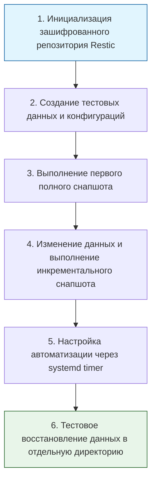

> [!abstract] Обзор главы
> На этом этапе мы обеспечиваем выживаемость инфраструктуры при катастрофических сбоях, человеческих ошибках или атаках программ-вымогателей (ransomware). Мы внедряем автоматизированные, шифрованные и проверяемые механизмы резервного копирования, а также отрабатываем сценарии аварийного восстановления (Disaster Recovery).

| Подпункт                                  | Фокус изучения (Инфраструктура + DevSecOps)                                                                             | Ключевые технологии                                              |
| :---------------------------------------- | :---------------------------------------------------------------------------------------------------------------------- | :--------------------------------------------------------------- |
| **9.1. Стратегии резервного копирования** | Правило 3-2-1, инкрементальное и дедуплицированное копирование, шифрование данных на стороне клиента                    | Restic, BorgBackup, rsync, Veeam, tar                            |
| **9.2. Аварийное восстановление (DR)**    | Метрики RPO и RTO, неизменяемость бэкапов (Immutability), автоматизация развертывания инфраструктуры из кода после сбоя | Disaster Recovery Plan (DRP), Terraform, Ansible, systemd timers |

---

## 1. 🎯 Суть и цель
Гарантия того, что потеря данных или полный отказ оборудования не приведут к остановке бизнеса. Цель — не просто создать копию файлов, а обеспечить её криптографическую защиту, изоляцию от основной сети (для защиты от шифровальщиков) и, самое главное, регулярную проверку возможности успешного восстановления (restore test) в рамках целевых показателей времени (RTO) и точки восстановления (RPO).

---

## 2. 📚 Что изучить (Теория)

| Тема | Конкретные вопросы для изучения |
| :--- | :--- |
| **Правило 3-2-1 и типы бэкапов** | • Классическое правило: 3 копии данных, на 2 разных типах носителей, 1 копия хранится вне площадки (offsite).<br>• Разница между полным (full), инкрементальным (только изменения с последнего бэкапа) и дифференциальным копированием.<br>• Принцип дедупликации: как современные инструменты (Restic, Borg) экономят место, храня только уникальные блоки данных. |
| **Метрики надежности (SRE)** | • RPO (Recovery Point Objective): максимально допустимый объем потери данных (например, "мы можем позволить себе потерять данные максимум за последние 15 минут").<br>• RTO (Recovery Time Objective): максимально допустимое время простоя системы до её полного восстановления. |
| **Безопасность резервных копий** | • Шифрование на стороне клиента (client-side encryption): данные шифруются до отправки в облако или на внешний диск.<br>• Неизменяемость (Immutability): настройка хранилища так, чтобы даже компрометированный root-пользователь не мог удалить или изменить существующие снапшоты в течение заданного периода (защита от ransomware). |

---

## 3. 💻 Практическая задача (Лабораторная работа)

**Название:** Настройка автоматического шифрованного инкрементального бэкапа с проверкой восстановления  
**Инструменты:** ВМ-1 (Ubuntu-Server), утилита Restic, systemd (для автоматизации).



**Пошаговое выполнение:**
1. **Установка и инициализация (на ВМ-1):**  
   Установите Restic: `sudo apt update && sudo apt install restic -y`  
   Создайте директорию для репозитория и инициализируйте его с паролем (пароль сохраните в надежном месте, без него данные не восстановить):  
   `mkdir -p /opt/backups/restic-repo`  
   `restic -r /opt/backups/restic-repo init` *(введите и запомните пароль)*
2. **Создание тестовых данных:**  
   `mkdir -p /etc/myapp/config`  
   `echo "db_password=super_secret_123" > /etc/myapp/config/app.conf`
3. **Первый бэкап (полный):**  
   `restic -r /opt/backups/restic-repo backup /etc/myapp`  
   *(Обратите внимание на объем обработанных данных в выводе).*
4. **Инкрементальный бэкап:**  
   Измените файл и добавьте новый:  
   `echo "api_key=new_key_456" >> /etc/myapp/config/app.conf`  
   `echo "debug=true" > /etc/myapp/config/debug.conf`  
   Снова запустите: `restic -r /opt/backups/restic-repo backup /etc/myapp`  
   *(Обратите внимание, что теперь обработано значительно меньше байт, так как Restic использует дедупликацию).*
5. **Автоматизация через systemd:**  
   Создайте файл `/etc/systemd/system/restic-backup.service`:
   ```ini
   [Unit]
   Description=Restic Backup Service
   [Service]
   Type=oneshot
   Environment=RESTIC_PASSWORD="ваш_пароль_от_репозитория"
   ExecStart=/usr/bin/restic -r /opt/backups/restic-repo backup /etc/myapp
   ```
   Создайте таймер `/etc/systemd/system/restic-backup.timer`:
   ```ini
   [Unit]
   Description=Run Restic Backup Daily
   [Timer]
   OnCalendar=daily
   Persistent=true
   [Install]
   WantedBy=timers.target
   ```
   Активируйте таймер: `sudo systemctl enable --now restic-backup.timer`
6. **Тестовое восстановление:**  
   Удалите тестовые данные: `sudo rm -rf /etc/myapp`  
   Восстановите их из конкретного снапшота (узнайте ID через `restic -r /opt/backups/restic-repo snapshots`):  
   `sudo restic -r /opt/backups/restic-repo restore <ID_СНАПШОТА> --target /tmp/restored_data`

---

## 4. ✅ Критерий успеха

| Проверка | Команда для терминала | Ожидаемый результат (Критерий успеха) |
| :--- | :--- | :--- |
| **Наличие снапшотов** | `sudo RESTIC_PASSWORD="пароль" restic -r /opt/backups/restic-repo snapshots` | Вывод показывает минимум 2 снапшота с разными временными метками и размерами. |
| **Эффективность инкремента** | Сравнение вывода двух команд `backup` | Второй запуск обрабатывает только новые/измененные байты (например, "Added to the repo: 50 B"), а не весь каталог заново. |
| **Успешное восстановление** | `cat /tmp/restored_data/etc/myapp/config/app.conf` | Файл существует и содержит обе строки (`db_password` и `api_key`), что доказывает работоспособность бэкапа. |
| **Работа автоматизации** | `systemctl list-timers restic-backup.timer` | Таймер активен (`ACTIVE`), указано время следующего срабатывания (NEXT). |

---

## 5. 🗣️ Фраза для собеседования

> «Я подхожу к резервному копированию не как к формальной задаче, а как к гарантированному механизму выживания системы. Я строго соблюдаю правило 3-2-1, использую инструменты с дедупликацией и шифрованием на стороне клиента, такие как Restic или Borg. Но главное: я считаю бэкап успешным только после регулярного тестового восстановления, что позволяет нам уверенно гарантировать бизнесу соблюдение целевых показателей RTO и RPO в случае реального инцидента».