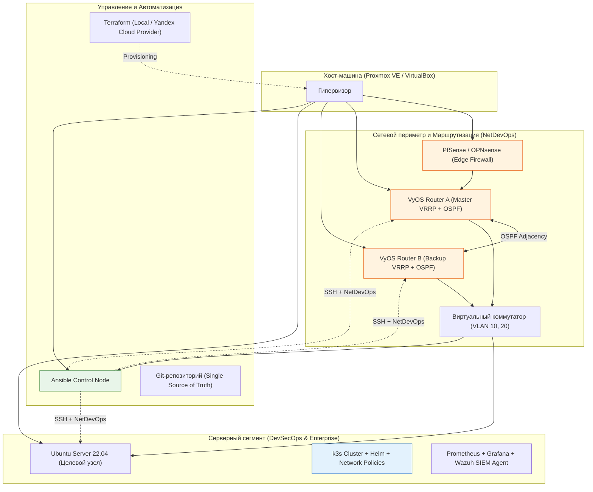

# DevSecOps-INFRASTRUCTURE-Network-Engineer

# 🛡️ Full-Stack DevSecOps & Network Infrastructure Lab

> **Концепция проекта**: Данный репозиторий представляет собой полноценный, автоматизированный полигон (Home Lab), воспроизводящий архитектуру корпоративного уровня. Проект объединяет практики **Network Engineering**, **DevSecOps** и **Site Reliability Engineering (SRE)**, демонстрируя полный жизненный цикл инфраструктуры: от проектирования отказоустойчивой сети до безопасного деплоя микросервисов и мониторинга.

---

## 🏗️ Архитектура инфраструктуры

Проект построен по принципу "Infrastructure as Code" (IaC) и эшелонированной защиты (Defense in Depth).

---

## 🚀 Ключевые возможности и реализованные практики

### 🌐 Network Engineering & High Availability
- **Динамическая маршрутизация**: Настроена соседство OSPF между пограничными маршрутизаторами для автоматического пересчета маршрутов.
- **Отказоустойчивость (HA)**: Реализован VRRP для резервирования шлюза по умолчанию. Тесты показывают переключение трафика (Failover) с потерей не более 1-2 пакетов при отключении Master-узла.
- **NetDevOps**: Конфигурации сетевых устройств (VyOS) управляются через Ansible с использованием шаблонов Jinja2, обеспечивая идемпотентность и версионирование в Git.

### 🛡️ DevSecOps & Security
- **Shift-Left Security**: CI/CD пайплайн (GitHub Actions) автоматически собирает Docker-образы и сканирует их на уязвимости (CVE) с помощью **Trivy**. Сборка прерывается при обнаружении критических уязвимостей.
- **Hardening**: Базовая настройка ОС включает отключение парольной аутентификации (только SSH-ключи), настройку UFW/iptables и Fail2ban для защиты от brute-force атак.
- **Защита приложений**: Nginx работает как Reverse Proxy с кастомными правилами WAF для блокировки базовых SQL-инъекций и XSS-атак на уровне L7.
- **Zero Trust в K8s**: Внедрены Kubernetes Network Policies, запрещающие межподовое взаимодействие по умолчанию, разрешая трафик только между явно доверенными компонентами.

### ⚙️ Automation & SRE
- **Infrastructure as Code**: Развертывание виртуальных машин автоматизировано через **Terraform** (с поддержкой локальных провайдеров и Yandex Cloud).
- **Наблюдаемость (Observability)**: Стек Prometheus + Grafana собирает метрики производительности, а агент Wazuh отправляет логи безопасности в SIEM для корреляции событий и алертинга.
- **Аварийное восстановление (DR)**: Настроено автоматическое, дедуплицированное и шифрованное резервное копирование конфигураций и данных с помощью **Restic**.

---

## 🛠️ Технологический стек

| Категория | Инструменты |
| :--- | :--- |
| **Виртуализация и Сеть** | Proxmox VE / VirtualBox, VyOS, PfSense, OSPF, VRRP, VLAN |
| **IaC и Конфигурация** | Terraform, Ansible, Jinja2, Git |
| **Контейнеры и Оркестрация** | Docker, k3s (Kubernetes), Helm, kubectl |
| **CI/CD и Реестры** | GitHub Actions, Trivy, GitHub Container Registry (GHCR) |
| **Мониторинг и SIEM** | Prometheus, Grafana, Wazuh, SNMP Exporter |
| **Безопасность и Бэкапы** | UFW, Fail2ban, Nginx WAF, Restic, SSH Keys |
| **Языки** | Bash, Python, HCL, YAML, Markdown |

