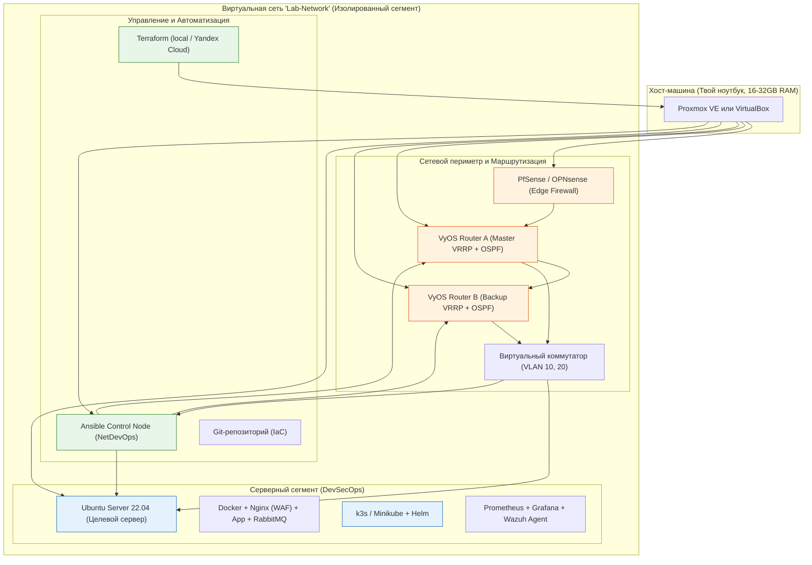

# ПОЛНЫЙ PRACTICAL ROADMAP: INFRASTRUCTURE + DEVSECOPS + ENTERPRISE

> [!abstract] Концепция проекта «Full-Stack Lab»
> Мы объединяем профессии в одну мощную практику. Ты построишь **целостный полигон с нуля**: от гипервизора и отказоустойчивой сетевой топологии (VyOS/PfSense) до защищённого приложения с CI/CD, SIEM и Enterprise-практиками (Kubernetes, Terraform, Cloud). Это даст понимание полного жизненного цикла инфраструктуры.

---

## ️ Общая архитектура финального стенда



---

## ️ Roadmap по 11 главам (Dual-Track)

| Глава | Инфраструктурный трек (Network/Infra Engineer) | DevSecOps + Enterprise трек | Итоговый артефакт в Git |
| :--- | :--- | :--- | :--- |
| **1. Фундамент** | Proxmox/VirtualBox, виртуальные сети (NAT, Bridge, Internal), TCP/IP | Базовый Linux hardening, SSH, жизненный цикл ВМ | Скрипт развертывания ВМ, схема сети |
| **2. Периметр и защита** | Настройка PfSense, правила Firewall, VLAN, DHCP | Отключение паролей, UFW/iptables внутри ВМ, fail2ban | Конфигурации firewall, playbook hardening |
| **3. Автоматизация (IaC)** | Управление сетевыми устройствами через API/CLI | Ansible для настройки ОС, Docker, идемпотентность | Ansible-роли для ОС и сети, инвентарь |
| **4. CI/CD и образы** | Сборка базовых образов ВМ (Packer) | GitHub Actions, Docker build, Trivy scan, GHCR | `.github/workflows/ci.yml`, Dockerfile |
| **5. Наблюдаемость** | SNMP-мониторинг сетевого оборудования, логи с роутера | Prometheus, Grafana, Wazuh SIEM, алертинг | `monitoring.yml`, дашборды, правила SIEM |
| **6. Сетевая безопасность** | Сегментация сети, IDS/IPS (Suricata) на шлюзе | Nginx Reverse Proxy, WAF (ModSecurity), TLS | Конфиг Nginx + WAF, правила Suricata |
| **7. Аудит и пентест** | Wireshark (анализ трафика между ВМ), проверка изоляции VLAN | Nmap, тестовые атаки, проверка срабатывания SIEM | Отчет `nmap-scan.md`, PCAP-файлы |
| **8. Микросервисы** | Настройка балансировки нагрузки (HAProxy), очереди | Docker Compose, RabbitMQ, Python-воркер | `docker-compose.yml` для микросервисов |
| **9. Аварийное восстановление** | Бэкап конфигураций сетевого оборудования и образов ВМ | Restic для шифрованного бэкапа данных и БД | Скрипт `backup-all.sh`, план DR |
| **10. SRE и Документация** | Схема L1-L3, нагрузочное тестирование сетевого канала | k6/ab тест приложения, Blameless Post-mortem | `architecture.drawio`, `post-mortem.md` |
| **11. Enterprise** | VyOS, OSPF, BGP, VRRP, NetDevOps, отказоустойчивые топологии, Автоматизация сетевых устройств через Ansible, Jinja2 | Terraform (local/Yandex Cloud), Kubernetes (k3s/minikube), Helm, Network Policies, Cloud IAM, дешевые облака | `main.tf`, `network_config.yml`, Helm-чарты, манифесты K8s |

---

##  Принцип прохождения

1. **Полигон, а не разрозненные задачи:** Мы строим одну среду. Глава 2 настраивает сеть для Главы 1, Глава 11 делает эту сеть отказоустойчивой и добавляет Enterprise-стек.
2. **Двойная проверка:** Каждое действие проверяется с точки зрения инфраструктуры (работает ли сеть?) и безопасности (защищено ли оно?).
3. **Всё как код:** Любая ручная настройка документируется для последующей автоматизации.
4. **Бюджетный подход:** VyOS, k3s, Wazuh, Restic, Terraform (local provider) — всё Open Source. Yandex Cloud — только опционально по бесплатному триалу (4000₽).

---

## ⚙️ Технический стек стенда

| Ресурс | Минимум | Рекомендуется |
| :--- | :--- | :--- |
| RAM | 16 GB | 32 GB (для k3s + VyOS + AppVM одновременно) |
| CPU | 4 ядра | 8 ядер |
| Диск | 100 GB SSD | 250 GB SSD |
| ОС хоста | Windows 10/11, macOS, Linux | Любая с VirtualBox/Proxmox |
| Сеть | Интернет для скачивания образов | — |
| Бюджет | 0 ₽ (полностью локально) | 0–4000 ₽ (опциональный триал Yandex Cloud) |

---

## 📁 Финальная структура Git-репозитория

```text
devsecops-lab/
├── README.md                         # Описание проекта и инструкция по развертыванию
├── architecture.drawio               # Полная схема инфраструктуры (L1-L3)
├── terraform/                        # Глава 11: Скрипты создания ВМ
│   ├── main.tf                       #   VirtualBox/Proxmox provider
│   └── yandex/                       #   Yandex Cloud provider (опционально)
├── ansible/                          # Главы 3, 11: Плейбуки
│   ├── site.yml                      #   Основной playbook для серверов
│   ├── network_config.yml            #   NetDevOps playbook для VyOS роутеров
│   └── roles/                        #   hardening, docker, monitoring, vyos
├── kubernetes/                       # Глава 11: Helm-чарты и манифесты (k3s)
│   ├── app-chart/
│   └── network-policies/
├── docker/                           # Главы 6, 8: Compose-файлы
├── .github/workflows/                # Глава 4: CI/CD пайплайн со сканированием Trivy
├── wazuh/                            # Глава 5: Кастомные правила SIEM
├── backups/                          # Глава 9: Скрипты Restic и бэкапы PfSense/VyOS
├── tests/                            # Главы 7, 10, 11
│   ├── nmap-scan.sh
│   ├── load-test.js
│   └── failover-test.sh
└── docs/                             # Глава 10
    ├── post-mortem.md
    └── network-topology.md
```

---

## 🎯 Итоговые компетенции после прохождения всех 11 глав

### DevSecOps + Enterprise Engineer
- ✅ Автоматизация инфраструктуры через Ansible и Terraform
- ✅ Построение CI/CD пайплайнов с интеграцией безопасности (Trivy, SAST)
- ✅ Настройка мониторинга (Prometheus, Grafana) и SIEM (Wazuh)
- ✅ Внедрение WAF, IDS/IPS и эшелонированной защиты
- ✅ Проведение аудитов безопасности и пентестов
- ✅ Построение микросервисной архитектуры с очередями сообщений
- ✅ Настройка резервного копирования и планов аварийного восстановления
- ✅ Развёртывание Kubernetes (k3s/minikube), упаковка в Helm, Network Policies
- ✅ Работа с облачным провайдером (Yandex Cloud) и Cloud IAM

### Infrastructure / Network Engineer
- ✅ Проектирование виртуальной инфраструктуры (Proxmox, VirtualBox)
- ✅ Настройка сетевых устройств (PfSense, VyOS, VLAN, DHCP)
- ✅ Динамическая маршрутизация (OSPF, BGP) и высокая доступность (VRRP, ECMP)
- ✅ Сетевая автоматизация (NetDevOps) через Ansible и Jinja2
- ✅ Телеметрия и глубокий мониторинг сети (SNMP, NetFlow)
- ✅ Построение отказоустойчивых топологий без единой точки отказа
- ✅ Бэкап и восстановление сетевых конфигураций
- ✅ Защищённые туннели (WireGuard, IPSec) и основы ZTNA

---

## 💼 Как это представить в резюме

**Проект: Построение защищённой Enterprise-инфраструктуры с нуля (Home Lab)**

* **Спроектировал и развернул** отказоустойчивую сетевую инфраструктуру с динамической маршрутизацией (OSPF/BGP), резервированием шлюза (VRRP) и сегментацией через VLAN, используя VyOS и PfSense.
* **Автоматизировал** настройку серверов и сетевых устройств через Ansible (NetDevOps) с шаблонизацией Jinja2, обеспечив идемпотентность и версионирование конфигураций в Git.
* **Внедрил DevSecOps практики:** настроил CI/CD пайплайн (GitHub Actions) со встроенным сканированием уязвимостей (Trivy), развернул Nginx Reverse Proxy с WAF-правилами и интегрировал сбор логов в SIEM (Wazuh).
* **Развернул Kubernetes-кластер (k3s)** с Helm-чартами и Network Policies, обеспечив изоляцию микросервисов на сетевом уровне.
* **Описал инфраструктуру как код** через Terraform (local provider + Yandex Cloud), автоматизировав создание ВМ и передачу управления Ansible.
* **Обеспечил наблюдаемость и надежность:** настроил мониторинг производительности (Prometheus + Grafana) и сетевой телеметрии (SNMP), протестировал отказоустойчивость сети (переключение VRRP за <1 секунду), настроил автоматическое шифрованное резервное копирование (Restic).
* **Стек:** Linux, VyOS, PfSense, Ansible, Terraform, Docker, Kubernetes (k3s), Helm, GitHub Actions, Nginx, Wazuh, Prometheus, Grafana, Restic, Python, Bash, OSPF, BGP, VRRP, Yandex Cloud.
